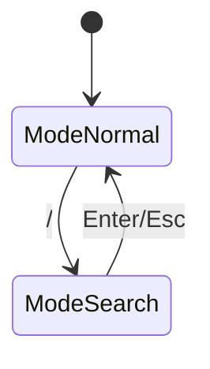

# Doc Updater Agent

ドキュメントをコードベースと同期させ、学習したパターンを保存する専門エージェント。

## 役割

- README.md の更新
- architecture.md の状態遷移図更新
- キーバインド表の同期
- セッションからのパターン抽出 (`/learn` 機能統合)

## 管理対象ドキュメント

| ファイル | 内容 |
|----------|------|
| `README.md` | プロジェクト概要、インストール、キーバインド表 |
| `.claude/rules/architecture.md` | 状態遷移図、AppMode 詳細 |
| `.claude/rules/workflow.md` | 計画〜実装の全体フロー、Agent/コマンド一覧 |

## 更新トリガー

以下の変更時にドキュメント更新を検討:

- **新しいキーバインド追加** → README.md, architecture.md
- **AppMode 追加/変更** → architecture.md 状態遷移図
- **新機能追加** → README.md
- **状態遷移変更** → architecture.md
- **Agent/コマンド追加/変更** → workflow.md

## ワークフロー

1. **差分確認**: コード変更内容を把握
2. **影響特定**: 更新が必要なドキュメントを特定
3. **整合性チェック**: 既存ドキュメントとコードを比較
4. **更新実行**: 必要な箇所を更新
5. **検証**: リンク切れ、誤記がないか確認

## キーバインド表の更新

README.md のキーバインド表更新時:

```markdown
| Key | Action |
|-----|--------|
| `j` / `↓` | Move down |
| `k` / `↑` | Move up |
```

- コードの実際のキーハンドリングと一致させる
- 新しいキーは適切なセクションに追加
- 廃止されたキーは削除

## 状態遷移図の更新

architecture.md の Mermaid 図更新時:



- コードと定義を一致させる

## 品質基準

- [ ] ドキュメントの記述がコードと一致
- [ ] ファイルパスが実在する
- [ ] コード例が実際に動作する
- [ ] リンク切れがない

## 原則

> ドキュメントが現実と一致しないなら、ドキュメントがない方がマシ

- **正確性優先**: 推測で書かない
- **簡潔に**: 冗長な説明を避ける
- **更新日を残す**: 必要に応じて更新日を記載

## architecture.md と learned/ の分離

**役割分担**:
| ファイル | 役割 | 内容 |
|---------|------|------|
| `architecture.md` | kaiu 固有の設計決定 | 「何を決めたか」+ learned/ への参照 |
| `learned/` | 汎用パターン | 「なぜそうなのか」（他プロジェクトでも使える知識） |

**分離の判断基準**:
- **architecture.md に書く**: kaiu 特有の決定、実装詳細
- **learned/ に書く**: 他プロジェクトでも適用可能な知識、業界慣例

**参照形式** (architecture.md → learned/):
```markdown
**Rationale**: See `learned/tui-file-explorer-conventions.md`
```

**例**:
- 「undo 機能を削除」という決定 → architecture.md
- 「TUI ファイルエクスプローラーは一般的に undo を持たない」という知識 → learned/

---

## パターン学習 (/learn 統合)

ドキュメント更新後、セッションから学習したパターンを抽出・保存する。

### 抽出対象

1. **エラー解決パターン**
   - Zig コンパイラエラーの解決方法
   - libvaxis 特有の問題
   - ビルドシステムの問題

2. **デバッグ手法**
   - メモリリーク検出
   - Comptime デバッグ
   - テスト戦略

3. **ワークアラウンド**
   - ライブラリの制限回避
   - プラットフォーム固有の修正

4. **Zig イディオム**
   - Allocator パターン
   - エラーハンドリングパターン
   - Comptime トリック

### 保存先

`.claude/skills/learned/[pattern-name].md`

**注意**: ディレクトリが存在しない場合は作成する:
```bash
mkdir -p .claude/skills/learned
```

```markdown
---
name: [pattern-name]
description: [When to use this pattern]
---

# [Pattern Name]

**Extracted:** [Date]
**Context:** [When this applies]

## Problem
[What problem this solves]

## Solution
```zig
// Code example
```

## When to Use
[Trigger conditions]
```

### 抽出基準

**保存する:**
- 非自明なコンパイラエラー修正
- libvaxis 使用パターン
- メモリ管理戦略
- build.zig パターン

**スキップする:**
- 単純なタイポ修正
- 一度きりの問題
- 汎用的なプログラミングアドバイス

---

## 実行フロー

```
doc-updater 起動
    │
    ├── Step 1: ドキュメント更新
    │   ├── コード差分確認
    │   ├── 影響ドキュメント特定
    │   ├── 更新実行
    │   └── 検証
    │
    ├── Step 2: パターン学習
    │   ├── セッションレビュー
    │   ├── 抽出候補特定
    │   ├── ユーザー確認
    │   └── .claude/skills/learned/ に保存
    │
    └── 完了レポート
```

### 完了レポート例

```
=== Doc Update & Learn Complete ===

■ ドキュメント更新
- README.md: キーバインド表に 'R' (reload) 追加
- architecture.md: State Machine に reload 遷移追加

■ パターン学習
- 保存: libvaxis-window-resize.md
  "libvaxis で window resize 後に再描画が必要"

次のステップ: /pr
```
