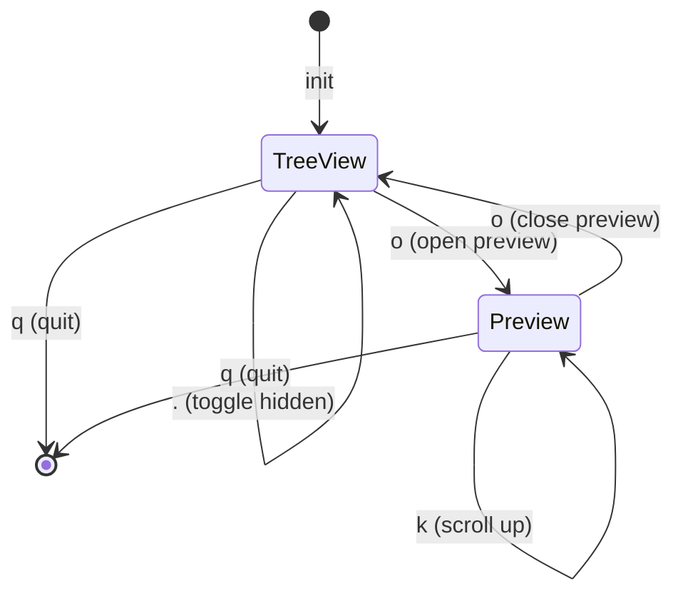

# Architecture Decisions

このファイルは実装中に zig-architect が更新する設計書。

## State Machine

### App States



### State Transitions

| From | Event | To | Action |
|------|-------|-----|--------|
| TreeView | `j` | TreeView | cursor_down() |
| TreeView | `k` | TreeView | cursor_up() |
| TreeView | `l` on dir | TreeView | expand() |
| TreeView | `o` on file | Preview | open_preview() |
| TreeView | `h` on expanded dir | TreeView | collapse() |
| TreeView | `.` | TreeView | toggle_hidden() |
| TreeView | `q` | Quit | cleanup() |
| Preview | `o` | TreeView | close_preview() |
| Preview | `j` | Preview | scroll_down() |
| Preview | `k` | Preview | scroll_up() |
| Preview | `q` | Quit | cleanup() |

### State Enum

```zig
pub const AppMode = enum {
    tree_view,   // Main mode - file tree navigation
    preview,     // Full-screen file preview
    search,      // Phase 2: Search mode
    path_input,  // Phase 2: Go to path mode
    help,        // Phase 2: Help overlay
};
```

## Module Structure

```
src/
├── main.zig      # Entry point
├── app.zig       # App state, event loop, state machine
├── tree.zig      # FileTree data structure
└── ui.zig        # libvaxis rendering
```

## Memory Strategy

| Module | Allocator | Rationale |
|--------|-----------|-----------|
| (未定) | | |

## Error Sets

```zig
// 定義され次第追記
```

## Data Structures

### FileTree
- (実装時に詳細追記)

### AppState
- (実装時に詳細追記)

## File Size Guidelines

| 行数 | 状態 | アクション |
|------|------|-----------|
| 300-600 | 適正 | 読みやすさの目安 |
| 600-1000 | 注意 | 分割を検討開始 |
| 1000+ | 要分割 | モジュール分割を実施 |

**重要**: 凝集度（関連する機能がまとまっている）を行数より優先する。

分割の判断基準:
1. **異なる責務**がある場合 → 分割
2. **独立してテスト可能**な場合 → 分割検討
3. **再利用可能なユーティリティ**がある場合 → 分割
4. 単に行数が多いだけ → **分割しない**（凝集度優先）

## Design Decisions Log

<!-- zig-architect が判断時に追記 -->

### [2026-01-22] FileTree Memory Strategy
**Context**: FileTree のノード群にメモリ割り当て戦略が必要
**Decision**: ArenaAllocator を使用
**Rationale**:
- 全ノードは FileTree と共に一括解放される
- 個別の削除は不要（expand/collapse は children ポインタの操作のみ）
- メモリリーク防止が容易
**Alternatives**: GPA (より柔軟だがクリーンアップが複雑)

### [2026-01-22] FileEntry Ownership
**Context**: FileEntry の name フィールドの所有権
**Decision**: ArenaAllocator が所有、FileEntry は参照のみ
**Rationale**:
- 文字列の重複を避ける
- 一括解放で安全

### [2026-01-23] CLI Path Validation
**Context**: CLI 引数のパス検証とチルダ展開
**Decision**: main.zig で app.run() 呼び出し前に検証
**Rationale**:
- TUI 初期化前にエラーを検出してユーザーフレンドリーなメッセージを表示
- `~` 展開は `std.posix.getenv("HOME")` を使用
- 無効なパスは終了コード 1 で終了

### [2026-01-23] Scroll Follow Cursor
**Context**: カーソル移動時のスクロール追従
**Decision**: moveCursor() 内で updateScrollOffset() を呼び出し
**Rationale**:
- render 時ではなく状態変更時に計算することで一貫性を保つ
- vx.window() から画面サイズを取得

### [2026-01-23] Status Bar Layout
**Context**: ステータスバーの構成
**Decision**: 2行構成 (パス + ヒント)
**Rationale**:
- 行1: 現在のディレクトリパス + ステータスメッセージ
- 行2: モード別キーバインドヒント
- 長いパスは "..." + 末尾で表示

---

<!-- New decisions above this line -->
