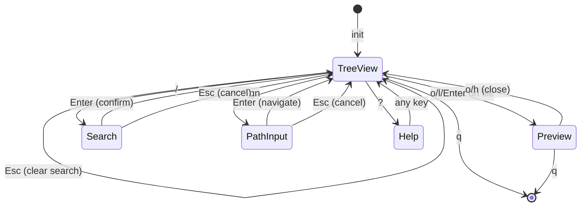

# Architecture Decisions

このファイルは実装中に zig-architect が更新する設計書。

## State Machine

### App States



### State Transitions

| From | Event | To | Action |
|------|-------|-----|--------|
| TreeView | `j`/`k` | TreeView | moveCursor() |
| TreeView | `l`/`Enter` on dir | TreeView | expandOrEnter() |
| TreeView | `l`/`Enter` on file | Preview | openPreview() |
| TreeView | `h` on expanded dir | TreeView | collapse() |
| TreeView | `h` on file/collapsed | TreeView | moveToParent() |
| TreeView | `.` | TreeView | toggleHidden() |
| TreeView | `gg` | TreeView | jumpToTop() |
| TreeView | `G` | TreeView | jumpToBottom() |
| TreeView | `H` | TreeView | collapseAll() |
| TreeView | `L` | TreeView | expandAll() |
| TreeView | `Tab` | TreeView | toggleCurrentDirectory() |
| TreeView | `R` | TreeView | reloadTree() |
| TreeView | `/` | Search | enterSearchMode() |
| TreeView | `n`/`N` | TreeView | nextSearchMatch()/prevSearchMatch() |
| TreeView | `Esc` | TreeView | clearSearch() |
| TreeView | `gn` | PathInput | enterPathInputMode() |
| TreeView | `c`/`C` | TreeView | copyPathToClipboard() |
| TreeView | `?` | Help | enterHelpMode() |
| TreeView | `q` | Quit | cleanup() |
| Search | `Enter` | TreeView | confirm search |
| Search | `Esc` | TreeView | clearSearch() |
| Search | char | Search | updateSearchResults() |
| PathInput | `Enter` | TreeView | navigateToInputPath() |
| PathInput | `Esc` | TreeView | cancel |
| Preview | `o`/`h` | TreeView | closePreview() |
| Preview | `j`/`k` | Preview | scroll |
| Preview | `q` | Quit | cleanup() |
| Help | any | TreeView | dismiss |

### State Enum

```zig
pub const AppMode = enum {
    tree_view,   // Main mode - file tree navigation
    preview,     // Full-screen file preview
    search,      // Incremental search mode
    path_input,  // Go to path mode
    help,        // Help overlay
};
```

## Module Structure

```
src/
├── main.zig      # Entry point, CLI args, path validation
├── app.zig       # App state, event loop, state machine (~1100 lines)
├── tree.zig      # FileTree data structure (~370 lines)
└── ui.zig        # libvaxis rendering, highlighting (~420 lines)
```

### Module Responsibilities

| Module | Responsibility |
|--------|---------------|
| main.zig | CLI引数処理、パス検証、チルダ展開、App初期化 |
| app.zig | アプリケーション状態、イベントループ、キー処理、検索ロジック |
| tree.zig | FileTree構造、展開/折りたたみ、可視インデックス変換 |
| ui.zig | レンダリング、検索ハイライト、ヘルプ表示、サニタイズ |

## Memory Strategy

| Module | Allocator | Rationale |
|--------|-----------|-----------|
| FileTree | GeneralPurposeAllocator | エントリごとに割り当て、deinit で個別解放 |
| FileEntry.name/path | 個別割り当て | deinit で allocator.free() |
| FileEntry.children | ArrayList(FileEntry) | 子エントリのリスト、再帰的に deinit |
| App.input_buffer | ArrayList(u8) | 検索/パス入力の動的バッファ |
| App.search_matches | ArrayList(usize) | マッチしたエントリのインデックス |
| App.render_arena | ArenaAllocator | フレームごとにリセット |

## Key Data Structures

### FileTree

```zig
pub const FileTree = struct {
    allocator: std.mem.Allocator,
    root_path: []const u8,
    entries: std.ArrayList(FileEntry),

    // Operations
    pub fn init(allocator: Allocator, path: []const u8) !*FileTree
    pub fn deinit(self: *FileTree) void
    pub fn readDirectory(self: *FileTree) !void
    pub fn toggleExpand(self: *FileTree, index: usize) !void
    pub fn collapseAt(self: *FileTree, index: usize) void
    pub fn countVisible(self: *FileTree, show_hidden: bool) usize
    pub fn visibleToActualIndex(self: *FileTree, visible_index: usize, show_hidden: bool) ?usize
    pub fn actualToVisibleIndex(self: *FileTree, actual_index: usize, show_hidden: bool) ?usize
};
```

### FileEntry

```zig
pub const EntryKind = enum {
    file,
    directory,
};

pub const FileEntry = struct {
    name: []const u8,                    // allocator.dupe で割り当て
    path: []const u8,                    // フルパス
    kind: EntryKind,                     // file or directory
    is_hidden: bool,
    expanded: bool,                      // ディレクトリのみ有効
    children: ?std.ArrayList(FileEntry), // 子エントリのリスト
    depth: usize,                        // インデント深さ

    pub fn deinit(self: *FileEntry, allocator: Allocator) void
    pub fn isDir(self: FileEntry) bool
};
```

### App State

```zig
pub const App = struct {
    allocator: std.mem.Allocator,
    file_tree: ?*tree.FileTree,
    mode: AppMode,
    cursor: usize,
    scroll_offset: usize,
    show_hidden: bool,
    last_wheel_time: i64,
    should_quit: bool,

    // Vaxis TUI
    tty: vaxis.Tty,
    vx: vaxis.Vaxis,
    loop: vaxis.Loop(Event),
    tty_buf: [4096]u8,
    render_arena: std.heap.ArenaAllocator,

    // Multi-key command state
    pending_key: PendingKey,
    status_message: ?[]const u8,

    // Input buffer for search/path input modes
    input_buffer: std.ArrayList(u8),

    // Search state
    search_query: ?[]const u8,
    search_matches: std.ArrayList(usize),
    current_match: usize,

    // Preview state
    preview_content: ?[]const u8,
    preview_path: ?[]const u8,
    preview_scroll: usize,
};
```

## Search Implementation

### Search Flow

1. `/` キーで検索モード開始
2. 入力ごとに `updateSearchResults()` を呼び出し
3. `search_matches` にマッチしたエントリのインデックスを保存
4. レンダリング時に `search_matches` を参照してハイライト
5. `n`/`N` でマッチ間を移動
6. `Esc` または `Enter` で検索モード終了

### Search State Refresh

ツリー構造変更時に検索結果を更新:
- `toggleHidden()` - 隠しファイル切替
- `expandOrEnter()` - ディレクトリ展開
- `handleBack()` - ディレクトリ折りたたみ
- `collapseAll()`/`expandAll()` - 全展開/全折りたたみ
- `toggleCurrentDirectory()` - Tab でトグル
- `reloadTree()` - リロード

## File Size Guidelines

| 行数 | 状態 | アクション |
|------|------|-----------|
| 300-600 | 適正 | 読みやすさの目安 |
| 600-1000 | 注意 | 分割を検討開始 |
| 1000+ | 要分割 | モジュール分割を実施 |

**現在のファイルサイズ**:
- app.zig: ~1100行 (分割検討対象)
- tree.zig: ~370行 (適正)
- ui.zig: ~420行 (適正)
- main.zig: ~140行 (適正)

**重要**: 凝集度（関連する機能がまとまっている）を行数より優先する。

分割の判断基準:
1. **異なる責務**がある場合 → 分割
2. **独立してテスト可能**な場合 → 分割検討
3. **再利用可能なユーティリティ**がある場合 → 分割
4. 単に行数が多いだけ → **分割しない**（凝集度優先）

## Design Decisions Log

<!-- zig-architect が判断時に追記 -->

### [2026-01-22] FileTree Memory Strategy
**Context**: FileTree のノード群にメモリ割り当て戦略が必要
**Decision**: GeneralPurposeAllocator でエントリごとに割り当て
**Rationale**:
- 展開/折りたたみ時にエントリを動的に追加/削除
- deinit で再帰的に解放
- ArrayList で子エントリを管理
**Note**: 当初 ArenaAllocator を検討したが、collapse 時のエントリ削除が必要なため GPA を採用

### [2026-01-22] FileEntry Ownership
**Context**: FileEntry の name/path フィールドの所有権
**Decision**: 各 FileEntry が allocator.dupe で所有、deinit で個別解放
**Rationale**:
- 展開時に新しいエントリを作成
- 折りたたみ時に子エントリを再帰的に解放

### [2026-01-23] CLI Path Validation
**Context**: CLI 引数のパス検証とチルダ展開
**Decision**: main.zig で app.run() 呼び出し前に検証
**Rationale**:
- TUI 初期化前にエラーを検出してユーザーフレンドリーなメッセージを表示
- `~` 展開は `std.posix.getenv("HOME")` を使用
- 無効なパスは終了コード 1 で終了

### [2026-01-23] Scroll Follow Cursor
**Context**: カーソル移動時のスクロール追従
**Decision**: moveCursor() 内で updateScrollOffset() を呼び出し
**Rationale**:
- render 時ではなく状態変更時に計算することで一貫性を保つ
- vx.window() から画面サイズを取得

### [2026-01-23] Status Bar Layout
**Context**: ステータスバーの構成
**Decision**: 2行構成 (パス + ヒント)
**Rationale**:
- 行1: 現在のディレクトリパス + ステータスメッセージ
- 行2: モード別キーバインドヒント
- 長いパスは "..." + 末尾で表示

### [2026-01-23] Search Highlight Performance
**Context**: 検索ハイライトのパフォーマンス最適化
**Decision**: `search_matches` にマッチインデックスを保存し、レンダリング時に参照
**Rationale**:
- 毎フレームの全エントリ検索を避ける
- マッチしたエントリのみ `findMatchPosition` を呼び出す
- ツリー変更時に `updateSearchResults()` で同期

### [2026-01-23] Search State Detection
**Context**: 検索アクティブ状態の判定方法
**Decision**: `input_buffer.items.len > 0` で判定
**Rationale**:
- 0件マッチ時も検索状態として扱う
- ESC で検索解除可能
- ステータスバーとヒントの表示切替に使用

---

<!-- New decisions above this line -->
