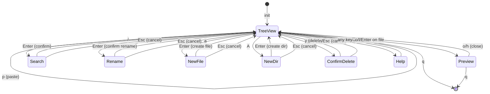

# Architecture Decisions

このファイルは実装中に zig-architect が更新する設計書。

## State Machine

### App States



### State Transitions

| From | Event | To | Action |
|------|-------|-----|--------|
| TreeView | `j`/`k` | TreeView | moveCursor() |
| TreeView | `l`/`Enter` on dir | TreeView | expandOrEnter() |
| TreeView | `l`/`Enter` on file | Preview | openPreview() |
| TreeView | `h` on expanded dir | TreeView | collapse() |
| TreeView | `h` on file/collapsed | TreeView | moveToParent() |
| TreeView | `.` | TreeView | toggleHidden() |
| TreeView | `gg` | TreeView | jumpToTop() |
| TreeView | `G` | TreeView | jumpToBottom() |
| TreeView | `H` | TreeView | collapseAll() |
| TreeView | `L` | TreeView | expandAll() |
| TreeView | `Tab` | TreeView | toggleCurrentDirectory() |
| TreeView | `R` | TreeView | reloadTree() |
| TreeView | `/` | Search | enterSearchMode() |
| TreeView | `n`/`N` | TreeView | nextSearchMatch()/prevSearchMatch() |
| TreeView | `Esc` | TreeView | clearSearch() |
| TreeView | `c`/`C` | TreeView | copyPathToClipboard() |
| TreeView | `Space` | TreeView | toggleMark() |
| TreeView | `y` | TreeView | yankFiles() |
| TreeView | `d` | TreeView | cutFiles() |
| TreeView | `p` | TreeView | pasteFiles() |
| TreeView | `r` | Rename | enterRenameMode() |
| TreeView | `a` | NewFile | enterNewFileMode() |
| TreeView | `A` | NewDir | enterNewDirMode() |
| TreeView | `D` | ConfirmDelete | enterConfirmDeleteMode() |
| TreeView | `?` | Help | enterHelpMode() |
| TreeView | `q` | Quit | cleanup() |
| Search | `Enter` | TreeView | confirm search |
| Search | `Esc` | TreeView | clearSearch() |
| Search | char | Search | updateSearchResults() |
| Rename | `Enter` | TreeView | performRename() |
| Rename | `Esc` | TreeView | cancel |
| NewFile | `Enter` | TreeView | createFile() |
| NewFile | `Esc` | TreeView | cancel |
| NewDir | `Enter` | TreeView | createDirectory() |
| NewDir | `Esc` | TreeView | cancel |
| ConfirmDelete | `y` | TreeView | performDelete() |
| ConfirmDelete | `n`/`Esc` | TreeView | cancel |
| Preview | `o`/`h` | TreeView | closePreview() |
| Preview | `j`/`k` | Preview | scroll |
| Preview | `q` | Quit | cleanup() |
| Help | any | TreeView | dismiss |

### State Enum

```zig
pub const AppMode = enum {
    tree_view,       // Main mode - file tree navigation
    preview,         // Full-screen file preview
    search,          // Incremental search mode
    rename,          // Rename file/directory
    new_file,        // Create new file
    new_dir,         // Create new directory
    confirm_delete,  // Delete confirmation
    help,            // Help overlay
};
```

## Module Structure

```
src/
├── main.zig      # Entry point, CLI args, path validation
├── app.zig       # App state, event loop, state machine
├── file_ops.zig  # File operations, path utilities
├── tree.zig      # FileTree data structure
├── ui.zig        # libvaxis rendering, highlighting
├── vcs.zig       # VCS integration (Git/JJ status)
├── image.zig     # Image format detection and dimensions
├── watcher.zig   # File system watching (mtime polling)
└── kitty_gfx.zig # Kitty Graphics Protocol for image display
```

### Module Responsibilities

| Module | Responsibility |
|--------|---------------|
| main.zig | CLI引数処理、パス検証、チルダ展開、App初期化 |
| app.zig | アプリケーション状態、イベントループ、キー処理、検索ロジック、ファイル操作呼び出し |
| file_ops.zig | ファイル・ディレクトリ操作 (copy/delete)、パス表示フォーマット、バリデーション、Base64エンコード |
| tree.zig | FileTree構造、展開/折りたたみ、可視インデックス変換 |
| ui.zig | レンダリング、検索ハイライト、ヘルプ表示、サニタイズ |
| vcs.zig | VCS検出、Git/JJステータス取得、ステータスマッピング |
| image.zig | 画像フォーマット検出、寸法抽出、マジックバイト検証 |
| watcher.zig | ファイルシステム監視、mtimeポーリング、デバウンス |
| kitty_gfx.zig | Kitty Graphics Protocol、RGBA送信、画像プレビュー |

## Memory Strategy

| Module | Allocator | Rationale |
|--------|-----------|-----------|
| FileTree | GeneralPurposeAllocator | エントリごとに割り当て、deinit で個別解放 |
| FileEntry.name/path | 個別割り当て | deinit で allocator.free() |
| FileEntry.children | ArrayList(FileEntry) | 子エントリのリスト、再帰的に deinit |
| App.input_buffer | ArrayList(u8) | 検索/パス入力の動的バッファ |
| App.search_matches | ArrayList(usize) | マッチしたエントリのインデックス |
| App.render_arena | ArenaAllocator | フレームごとにリセット |

## Key Data Structures

### FileTree

```zig
pub const FileTree = struct {
    allocator: std.mem.Allocator,
    root_path: []const u8,
    entries: std.ArrayList(FileEntry),

    // Operations
    pub fn init(allocator: std.mem.Allocator, path: []const u8) !*FileTree
    pub fn deinit(self: *FileTree) void
    pub fn readDirectory(self: *FileTree) !void
    pub fn toggleExpand(self: *FileTree, index: usize) !void
    pub fn collapseAt(self: *FileTree, index: usize) void
    pub fn countVisible(self: *FileTree, show_hidden: bool) usize
    pub fn visibleToActualIndex(self: *FileTree, visible_index: usize, show_hidden: bool) ?usize
    pub fn actualToVisibleIndex(self: *FileTree, actual_index: usize, show_hidden: bool) ?usize
};
```

### FileEntry

```zig
pub const EntryKind = enum {
    file,
    directory,
};

pub const FileEntry = struct {
    name: []const u8,                    // allocator.dupe で割り当て
    path: []const u8,                    // フルパス
    kind: EntryKind,                     // file or directory
    is_hidden: bool,
    expanded: bool,                      // ディレクトリのみ有効
    children: ?std.ArrayList(FileEntry), // 子エントリのリスト
    depth: usize,                        // インデント深さ

    pub fn deinit(self: *FileEntry, allocator: std.mem.Allocator) void
    pub fn isDir(self: FileEntry) bool
};
```

### App State

```zig
pub const App = struct {
    allocator: std.mem.Allocator,
    file_tree: ?*tree.FileTree,
    mode: AppMode,
    cursor: usize,
    scroll_offset: usize,
    show_hidden: bool,
    last_wheel_time: i64,
    should_quit: bool,

    // Vaxis TUI
    tty: vaxis.Tty,
    vx: vaxis.Vaxis,
    loop: vaxis.Loop(Event),
    tty_buf: [4096]u8,
    render_arena: std.heap.ArenaAllocator,

    // Multi-key command state
    pending_key: PendingKey,
    status_message: ?[]const u8,

    // Input buffer for search/path input modes
    input_buffer: std.ArrayList(u8),

    // Search state
    search_query: ?[]const u8,
    search_matches: std.ArrayList(usize),
    current_match: usize,

    // Preview state
    preview_content: ?[]const u8,
    preview_path: ?[]const u8,
    preview_scroll: usize,

    // File operations state
    marked_files: std.StringHashMap(void),
    clipboard_files: std.ArrayList([]const u8),
    clipboard_operation: ClipboardOperation,
};
```

## Search Implementation

### Search Flow

1. `/` キーで検索モード開始
2. 入力ごとに `updateSearchResults()` を呼び出し
3. `search_matches` にマッチしたエントリのインデックスを保存
4. レンダリング時に `search_matches` を参照してハイライト
5. `n`/`N` でマッチ間を移動
6. `Esc` または `Enter` で検索モード終了

### Search State Refresh

ツリー構造変更時に検索結果を更新:
- `toggleHidden()` - 隠しファイル切替
- `expandOrEnter()` - ディレクトリ展開
- `handleBack()` - ディレクトリ折りたたみ
- `collapseAll()`/`expandAll()` - 全展開/全折りたたみ
- `toggleCurrentDirectory()` - Tab でトグル
- `reloadTree()` - リロード

## File Size Guidelines

| 行数 | 状態 | アクション |
|------|------|-----------|
| 300-600 | 適正 | 読みやすさの目安 |
| 600-1000 | 注意 | 分割を検討開始 |
| 1000+ | 要分割 | モジュール分割を実施 |

**現在のファイルサイズ**:
- app.zig: ~2000行 (Phase 3 機能追加後、凝集度を保ちつつ外部統合コードを含む)
- file_ops.zig: ~390行 (適正 - App非依存のファイル操作)
- tree.zig: ~370行 (適正)
- ui.zig: ~700行 (適正 - VCS色表示、画像プレビュー含む)
- vcs.zig: ~450行 (適正 - Git/JJステータス検出)
- image.zig: ~334行 (適正 - 画像フォーマット検出)
- watcher.zig: ~209行 (適正 - ファイルシステム監視)
- kitty_gfx.zig: ~150行 (適正 - Kitty Graphics Protocol)
- main.zig: ~174行 (適正)

**重要**: 凝集度（関連する機能がまとまっている）を行数より優先する。

分割の判断基準:
1. **異なる責務**がある場合 → 分割
2. **独立してテスト可能**な場合 → 分割検討
3. **再利用可能なユーティリティ**がある場合 → 分割
4. 単に行数が多いだけ → **分割しない**（凝集度優先）

## Design Decisions Log

<!-- zig-architect が判断時に追記 -->

### 記録ガイドライン

**役割分担**:
- **architecture.md**: kaiu 固有の設計決定 (「何を決めたか」)
- **`.claude/skills/learned/`**: 汎用パターン (「なぜそうなのか」- 他プロジェクトでも使える知識)

**参照形式**: 汎用的な Rationale は `.claude/skills/learned/` に分離し、参照で記載:
```markdown
**Rationale**: See `.claude/skills/learned/[pattern-name].md`
```

**判断基準**:
- kaiu 特有の決定 → ここに詳細を記載
- 他プロジェクトでも適用可能な知識 → `.claude/skills/learned/` に保存して参照

### [2026-01-22] FileTree Memory Strategy
**Context**: FileTree のノード群にメモリ割り当て戦略が必要
**Decision**: GeneralPurposeAllocator でエントリごとに割り当て
**Rationale**:
- 展開/折りたたみ時にエントリを動的に追加/削除
- deinit で再帰的に解放
- ArrayList で子エントリを管理
**Note**: 当初 ArenaAllocator を検討したが、collapse 時のエントリ削除が必要なため GPA を採用

### [2026-01-22] FileEntry Ownership
**Context**: FileEntry の name/path フィールドの所有権
**Decision**: 各 FileEntry が allocator.dupe で所有、deinit で個別解放
**Rationale**:
- 展開時に新しいエントリを作成
- 折りたたみ時に子エントリを再帰的に解放

### [2026-01-23] CLI Path Validation
**Context**: CLI 引数のパス検証とチルダ展開
**Decision**: main.zig で app.run() 呼び出し前に検証
**Rationale**:
- TUI 初期化前にエラーを検出してユーザーフレンドリーなメッセージを表示
- `~` 展開は `std.posix.getenv("HOME")` を使用
- 無効なパスは終了コード 1 で終了

### [2026-01-23] Scroll Follow Cursor
**Context**: カーソル移動時のスクロール追従
**Decision**: moveCursor() 内で updateScrollOffset() を呼び出し
**Rationale**:
- render 時ではなく状態変更時に計算することで一貫性を保つ
- vx.window() から画面サイズを取得

### [2026-01-23] Status Bar Layout
**Context**: ステータスバーの構成
**Decision**: 2行構成 (パス + ヒント)
**Rationale**:
- 行1: 現在のディレクトリパス + ステータスメッセージ
- 行2: モード別キーバインドヒント
- 長いパスは "..." + 末尾で表示

### [2026-01-23] Search Highlight Performance
**Context**: 検索ハイライトのパフォーマンス最適化
**Decision**: `search_matches` にマッチインデックスを保存し、レンダリング時に参照
**Rationale**:
- 毎フレームの全エントリ検索を避ける
- マッチしたエントリのみ `findMatchPosition` を呼び出す
- ツリー変更時に `updateSearchResults()` で同期

### [2026-01-23] Search State Detection
**Context**: 検索アクティブ状態の判定方法
**Decision**: `input_buffer.items.len > 0` で判定
**Rationale**:
- 0件マッチ時も検索状態として扱う
- ESC で検索解除可能
- ステータスバーとヒントの表示切替に使用

### [2026-01-24] Input Mode Infrastructure (Phase 2)
**Context**: rename, new file, new dir, confirm delete で再利用可能な入力が必要
**Decision**: AppMode を拡張して新しい入力モードを追加、既存の input_buffer を共有
**Rationale**:
- 既に search で input_buffer を使用するパターンがある
- 新しいモード: `rename`, `new_file`, `new_dir`, `confirm_delete`
- モードごとにプロンプトと Enter 時の動作を切り替え
- 別モジュール作成よりも凝集度を優先
**New Modes**:
- `rename`: r キーでトリガー、現在のファイル名を初期値として input_buffer に設定
- `new_file`: a キーでトリガー、空の input_buffer で開始
- `new_dir`: A キーでトリガー、空の input_buffer で開始
- `confirm_delete`: D キーでトリガー、y/n で確認

### [2026-01-24] File Marking System (Phase 2)
**Context**: 複数ファイルの一括操作のためマーキングシステムが必要
**Decision**: App に `marked_files: std.StringHashMap(void)` を追加
**Rationale**:
- パスをキーとした HashSet でマーク状態を管理
- ツリー再読み込み後もパスでマーク状態を復元可能
- FileEntry に marked フィールドを追加するより柔軟

### [2026-01-24] Clipboard State for Yank/Cut (Phase 2)
**Context**: yank/cut したファイルの一時保存が必要
**Decision**: App に clipboard_files と clipboard_operation フィールドを追加
**Rationale**:
- `clipboard_operation: ClipboardOperation` で操作種別を保持 (none/copy/cut)
- `clipboard_files: std.ArrayList([]const u8)` でパスリストを保持
- paste 時に operation に応じてコピーまたは移動

### [2026-01-24] File Operations Error Handling (Phase 2)
**Context**: ファイル操作 (yank/cut/paste/delete/rename/create) のエラーハンドリング
**Decision**: 各操作でエラーを catch して status_message で通知
**Rationale**:
- ユーザーフレンドリーなエラー表示
- 操作失敗時も TUI は安定動作を継続
- ステータスバーに "Error: ..." メッセージを表示
**Implementation**:
- `yankFiles()`, `cutFiles()`: marked_files が空の場合はカーソル位置を使用
- `pasteFiles()`: ファイル名の衝突を検出して数値サフィックス追加
- `deleteFiles()`: confirm_delete モードで y/n 確認
- `renameFile()`: rename モードで新しい名前を入力
- `createFile()`/`createDirectory()`: new_file/new_dir モードで名前を入力

### [2026-01-24] Tree Reload After File Operations (Phase 2)
**Context**: paste/delete/rename/create 後のツリー再読み込み
**Decision**: 操作完了後に reloadTree() を呼び出し
**Rationale**:
- ファイルシステム変更を即座に反映
- マーク状態は marked_files HashSet で保持されるため、パスベースで復元可能
- カーソル位置は可能な限り維持 (該当エントリが存在すればパスで検索)

### [2026-01-24] Status Bar Path Display (FR-030, FR-031)
**Context**: ステータスバーに表示するパスの形式
- FR-030: 絶対パスで表示 (`.` や相対パスではない)
- FR-031: ホームディレクトリ以下は `~` prefix で表示

**Decision**: 2段階のアプローチ
1. **init 時**: main.zig で `realpathAlloc()` を使用して絶対パスに変換
2. **表示時**: ui.zig でホームディレクトリを `~` に置換

**Implementation**:
```zig
// main.zig - 絶対パス変換
const resolved = try std.fs.cwd().realpathAlloc(allocator, path);

// ui.zig or app.zig - 表示用 ~ 置換
fn formatDisplayPath(arena: Allocator, path: []const u8) []const u8 {
    const home = std.posix.getenv("HOME") orelse return path;
    if (std.mem.startsWith(u8, path, home)) {
        return std.fmt.allocPrint(arena, "~{s}", .{path[home.len..]});
    }
    return path;
}
```

**Rationale**:
- 保存時は絶対パス: ファイル操作で一貫性を保つ
- 表示時は `~` 置換: ユーザーフレンドリーで読みやすい
- init 時に計算: 毎フレームの計算を避ける
- render_arena で一時割り当て: 表示用文字列はフレームごとにリセット

**Alternatives Considered**:
- 保存時に `~` を含める: ファイル操作時に再度展開が必要、複雑化
- render 時に realpath: 毎フレーム I/O 発生、パフォーマンス問題

**Data Flow**:
```
CLI arg     main.zig              FileTree            Status Bar
  "."   --> realpathAlloc() --> root_path          --> formatDisplayPath()
            "/Users/x/kaiu"    "/Users/x/kaiu"        "~/kaiu"
```

### [2026-01-24] Undo機能を削除
**Context**: undo 機能の要否を検討
**Decision**: undo機能 (US7, FR-032-FR-037) を削除し、削除確認ダイアログに依存する
**Rationale**: See `.claude/skills/learned/tui-file-explorer-conventions.md`
**Note**: コードの複雑さ軽減、シンボリックリンク処理の問題解消も副次的なメリット

### [2026-01-25] file_ops.zig モジュール抽出
**Context**: app.zig が 2253行と肥大化、ファイル操作関連のコードを分離
**Decision**: file_ops.zig を新規作成し、App非依存のファイルシステム操作を抽出
**Result**: app.zig: 2253行 → 1887行 (-366行)、file_ops.zig: 390行 (新規)
**Extracted Functions**:
- `isValidFilename()`, `encodeBase64()`: バリデーション・エンコーディング
- `copyPath()`, `copyDirRecursive()`, `deletePathRecursive()`: ファイル操作
- `formatDisplayPath()`, `isBinaryContent()`: 表示・判定ユーティリティ
- `ClipboardOperation` enum
**Rationale**:
- **App非依存性**: App state 依存なし、単独テスト可能な関数群
- **再利用性**: 他のモジュールから直接呼び出し可能
- **責務分離**: app.zig は状態管理・イベント処理に集中
- **凝集度**: ファイル操作が一箇所にまとまる
**Not Extracted**:
- Search/Preview 機能: App state に強く依存 (mode, cursor, scroll など)
- 抽出すると凝集度が下がる
**Note**: Phase 2 評価で search.zig / preview.zig への分割は見送り

### [2026-01-26] Phase 3 外部統合モジュール群
**Context**: VCS統合、画像プレビュー、ファイル監視機能を追加
**Decision**: 機能ごとに独立モジュールを作成 (vcs.zig, image.zig, watcher.zig, kitty_gfx.zig)
**Rationale**:
- **責務分離**: 各機能が明確に分離され、単独テスト可能
- **依存性管理**: App state への依存を最小化
- **再利用性**: 他プロジェクトへの移植が容易
**Implementation Patterns**:
- **VCS統合**: Git/JJ両対応、タイムアウト付きコマンド実行、ゾンビプロセス回避パターン
- **画像処理**: マジックバイト検証、フォーマット別パース、寸法抽出
- **ファイル監視**: mtimeポーリング、デバウンス、クロスプラットフォーム対応
- **Kitty Graphics**: RGBA送信、Ghostty検出、フォールバック実装
**Rationale**: See `.claude/skills/learned/kitty-graphics-rgba-transmit.md`, `.claude/skills/learned/ghostty-terminal-detection.md`, `.claude/skills/learned/mtime-polling-file-watch.md`

### [2026-01-26] Drag & Drop UTF-8 Limitation (#61)
**Context**: Finder からのドラッグ&ドロップ実装、日本語ファイル名が動作しない
**Decision**: ASCII ファイル名のみサポート、UTF-8 エンコード処理を追加、制限を明示
**Implementation**:
- Bracketed paste イベントで UTF-8 エンコード (`std.unicode.utf8Encode`)
- バックスラッシュエスケープ解除 (`\ ` → ` `)
- カーソル位置のディレクトリにドロップ
**Limitation**:
- libvaxis の bracketed paste 実装が UTF-8 マルチバイト文字を一部 U+FFFD に変換
- 日本語ファイル名は内部 yank/paste (y/p) を使用するよう案内
**Rationale**: See `.claude/skills/learned/libvaxis-bracketed-paste-utf8-limitation.md`
**Related**: [bemenu #410](https://github.com/Cloudef/bemenu/issues/410)

---

<!-- New decisions above this line -->
