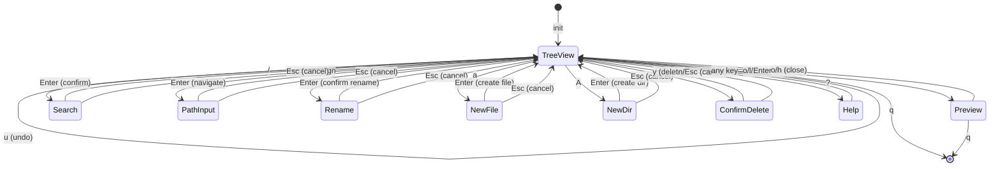

# Architecture Decisions

このファイルは実装中に zig-architect が更新する設計書。

## State Machine

### App States



### State Transitions

| From | Event | To | Action |
|------|-------|-----|--------|
| TreeView | `j`/`k` | TreeView | moveCursor() |
| TreeView | `l`/`Enter` on dir | TreeView | expandOrEnter() |
| TreeView | `l`/`Enter` on file | Preview | openPreview() |
| TreeView | `h` on expanded dir | TreeView | collapse() |
| TreeView | `h` on file/collapsed | TreeView | moveToParent() |
| TreeView | `.` | TreeView | toggleHidden() |
| TreeView | `gg` | TreeView | jumpToTop() |
| TreeView | `G` | TreeView | jumpToBottom() |
| TreeView | `H` | TreeView | collapseAll() |
| TreeView | `L` | TreeView | expandAll() |
| TreeView | `Tab` | TreeView | toggleCurrentDirectory() |
| TreeView | `R` | TreeView | reloadTree() |
| TreeView | `/` | Search | enterSearchMode() |
| TreeView | `n`/`N` | TreeView | nextSearchMatch()/prevSearchMatch() |
| TreeView | `Esc` | TreeView | clearSearch() |
| TreeView | `gn` | PathInput | enterPathInputMode() |
| TreeView | `c`/`C` | TreeView | copyPathToClipboard() |
| TreeView | `Space` | TreeView | toggleMark() |
| TreeView | `y` | TreeView | yankFiles() |
| TreeView | `d` | TreeView | cutFiles() |
| TreeView | `p` | TreeView | pasteFiles() |
| TreeView | `u` | TreeView | undoLastOperation() |
| TreeView | `r` | Rename | enterRenameMode() |
| TreeView | `a` | NewFile | enterNewFileMode() |
| TreeView | `A` | NewDir | enterNewDirMode() |
| TreeView | `D` | ConfirmDelete | enterConfirmDeleteMode() |
| TreeView | `?` | Help | enterHelpMode() |
| TreeView | `q` | Quit | cleanup() |
| Search | `Enter` | TreeView | confirm search |
| Search | `Esc` | TreeView | clearSearch() |
| Search | char | Search | updateSearchResults() |
| PathInput | `Enter` | TreeView | navigateToInputPath() |
| PathInput | `Esc` | TreeView | cancel |
| Rename | `Enter` | TreeView | performRename() |
| Rename | `Esc` | TreeView | cancel |
| NewFile | `Enter` | TreeView | createFile() |
| NewFile | `Esc` | TreeView | cancel |
| NewDir | `Enter` | TreeView | createDirectory() |
| NewDir | `Esc` | TreeView | cancel |
| ConfirmDelete | `y` | TreeView | performDelete() |
| ConfirmDelete | `n`/`Esc` | TreeView | cancel |
| Preview | `o`/`h` | TreeView | closePreview() |
| Preview | `j`/`k` | Preview | scroll |
| Preview | `q` | Quit | cleanup() |
| Help | any | TreeView | dismiss |

### State Enum

```zig
pub const AppMode = enum {
    tree_view,       // Main mode - file tree navigation
    preview,         // Full-screen file preview
    search,          // Incremental search mode
    path_input,      // Go to path mode
    rename,          // Rename file/directory
    new_file,        // Create new file
    new_dir,         // Create new directory
    confirm_delete,  // Delete confirmation
    help,            // Help overlay
};
```

## Module Structure

```
src/
├── main.zig      # Entry point, CLI args, path validation
├── app.zig       # App state, event loop, state machine (~1100 lines)
├── tree.zig      # FileTree data structure (~370 lines)
└── ui.zig        # libvaxis rendering, highlighting (~420 lines)
```

### Module Responsibilities

| Module | Responsibility |
|--------|---------------|
| main.zig | CLI引数処理、パス検証、チルダ展開、App初期化 |
| app.zig | アプリケーション状態、イベントループ、キー処理、検索ロジック |
| tree.zig | FileTree構造、展開/折りたたみ、可視インデックス変換 |
| ui.zig | レンダリング、検索ハイライト、ヘルプ表示、サニタイズ |

## Memory Strategy

| Module | Allocator | Rationale |
|--------|-----------|-----------|
| FileTree | GeneralPurposeAllocator | エントリごとに割り当て、deinit で個別解放 |
| FileEntry.name/path | 個別割り当て | deinit で allocator.free() |
| FileEntry.children | ArrayList(FileEntry) | 子エントリのリスト、再帰的に deinit |
| App.input_buffer | ArrayList(u8) | 検索/パス入力の動的バッファ |
| App.search_matches | ArrayList(usize) | マッチしたエントリのインデックス |
| App.render_arena | ArenaAllocator | フレームごとにリセット |
| App.undo_state | UndoState | 直前の操作情報、エントリごとにパスを所有 |
| App.undo_staging_dir | []const u8 | /tmp/kaiu-undo-{pid}、deinit で削除 |

## Key Data Structures

### FileTree

```zig
pub const FileTree = struct {
    allocator: std.mem.Allocator,
    root_path: []const u8,
    entries: std.ArrayList(FileEntry),

    // Operations
    pub fn init(allocator: std.mem.Allocator, path: []const u8) !*FileTree
    pub fn deinit(self: *FileTree) void
    pub fn readDirectory(self: *FileTree) !void
    pub fn toggleExpand(self: *FileTree, index: usize) !void
    pub fn collapseAt(self: *FileTree, index: usize) void
    pub fn countVisible(self: *FileTree, show_hidden: bool) usize
    pub fn visibleToActualIndex(self: *FileTree, visible_index: usize, show_hidden: bool) ?usize
    pub fn actualToVisibleIndex(self: *FileTree, actual_index: usize, show_hidden: bool) ?usize
};
```

### FileEntry

```zig
pub const EntryKind = enum {
    file,
    directory,
};

pub const FileEntry = struct {
    name: []const u8,                    // allocator.dupe で割り当て
    path: []const u8,                    // フルパス
    kind: EntryKind,                     // file or directory
    is_hidden: bool,
    expanded: bool,                      // ディレクトリのみ有効
    children: ?std.ArrayList(FileEntry), // 子エントリのリスト
    depth: usize,                        // インデント深さ

    pub fn deinit(self: *FileEntry, allocator: std.mem.Allocator) void
    pub fn isDir(self: FileEntry) bool
};
```

### App State

```zig
pub const App = struct {
    allocator: std.mem.Allocator,
    file_tree: ?*tree.FileTree,
    mode: AppMode,
    cursor: usize,
    scroll_offset: usize,
    show_hidden: bool,
    last_wheel_time: i64,
    should_quit: bool,

    // Vaxis TUI
    tty: vaxis.Tty,
    vx: vaxis.Vaxis,
    loop: vaxis.Loop(Event),
    tty_buf: [4096]u8,
    render_arena: std.heap.ArenaAllocator,

    // Multi-key command state
    pending_key: PendingKey,
    status_message: ?[]const u8,

    // Input buffer for search/path input modes
    input_buffer: std.ArrayList(u8),

    // Search state
    search_query: ?[]const u8,
    search_matches: std.ArrayList(usize),
    current_match: usize,

    // Preview state
    preview_content: ?[]const u8,
    preview_path: ?[]const u8,
    preview_scroll: usize,
};
```

## Search Implementation

### Search Flow

1. `/` キーで検索モード開始
2. 入力ごとに `updateSearchResults()` を呼び出し
3. `search_matches` にマッチしたエントリのインデックスを保存
4. レンダリング時に `search_matches` を参照してハイライト
5. `n`/`N` でマッチ間を移動
6. `Esc` または `Enter` で検索モード終了

### Search State Refresh

ツリー構造変更時に検索結果を更新:
- `toggleHidden()` - 隠しファイル切替
- `expandOrEnter()` - ディレクトリ展開
- `handleBack()` - ディレクトリ折りたたみ
- `collapseAll()`/`expandAll()` - 全展開/全折りたたみ
- `toggleCurrentDirectory()` - Tab でトグル
- `reloadTree()` - リロード

## File Size Guidelines

| 行数 | 状態 | アクション |
|------|------|-----------|
| 300-600 | 適正 | 読みやすさの目安 |
| 600-1000 | 注意 | 分割を検討開始 |
| 1000+ | 要分割 | モジュール分割を実施 |

**現在のファイルサイズ**:
- app.zig: ~1100行 (分割検討対象)
- tree.zig: ~370行 (適正)
- ui.zig: ~420行 (適正)
- main.zig: ~140行 (適正)

**重要**: 凝集度（関連する機能がまとまっている）を行数より優先する。

分割の判断基準:
1. **異なる責務**がある場合 → 分割
2. **独立してテスト可能**な場合 → 分割検討
3. **再利用可能なユーティリティ**がある場合 → 分割
4. 単に行数が多いだけ → **分割しない**（凝集度優先）

## Design Decisions Log

<!-- zig-architect が判断時に追記 -->

### [2026-01-22] FileTree Memory Strategy
**Context**: FileTree のノード群にメモリ割り当て戦略が必要
**Decision**: GeneralPurposeAllocator でエントリごとに割り当て
**Rationale**:
- 展開/折りたたみ時にエントリを動的に追加/削除
- deinit で再帰的に解放
- ArrayList で子エントリを管理
**Note**: 当初 ArenaAllocator を検討したが、collapse 時のエントリ削除が必要なため GPA を採用

### [2026-01-22] FileEntry Ownership
**Context**: FileEntry の name/path フィールドの所有権
**Decision**: 各 FileEntry が allocator.dupe で所有、deinit で個別解放
**Rationale**:
- 展開時に新しいエントリを作成
- 折りたたみ時に子エントリを再帰的に解放

### [2026-01-23] CLI Path Validation
**Context**: CLI 引数のパス検証とチルダ展開
**Decision**: main.zig で app.run() 呼び出し前に検証
**Rationale**:
- TUI 初期化前にエラーを検出してユーザーフレンドリーなメッセージを表示
- `~` 展開は `std.posix.getenv("HOME")` を使用
- 無効なパスは終了コード 1 で終了

### [2026-01-23] Scroll Follow Cursor
**Context**: カーソル移動時のスクロール追従
**Decision**: moveCursor() 内で updateScrollOffset() を呼び出し
**Rationale**:
- render 時ではなく状態変更時に計算することで一貫性を保つ
- vx.window() から画面サイズを取得

### [2026-01-23] Status Bar Layout
**Context**: ステータスバーの構成
**Decision**: 2行構成 (パス + ヒント)
**Rationale**:
- 行1: 現在のディレクトリパス + ステータスメッセージ
- 行2: モード別キーバインドヒント
- 長いパスは "..." + 末尾で表示

### [2026-01-23] Search Highlight Performance
**Context**: 検索ハイライトのパフォーマンス最適化
**Decision**: `search_matches` にマッチインデックスを保存し、レンダリング時に参照
**Rationale**:
- 毎フレームの全エントリ検索を避ける
- マッチしたエントリのみ `findMatchPosition` を呼び出す
- ツリー変更時に `updateSearchResults()` で同期

### [2026-01-23] Search State Detection
**Context**: 検索アクティブ状態の判定方法
**Decision**: `input_buffer.items.len > 0` で判定
**Rationale**:
- 0件マッチ時も検索状態として扱う
- ESC で検索解除可能
- ステータスバーとヒントの表示切替に使用

### [2026-01-24] Input Mode Infrastructure (Phase 2)
**Context**: rename, new file, new dir, confirm delete で再利用可能な入力が必要
**Decision**: AppMode を拡張して新しい入力モードを追加、既存の input_buffer を共有
**Rationale**:
- 既に search と path_input で input_buffer を使用するパターンがある
- 新しいモード: `rename`, `new_file`, `new_dir`, `confirm_delete`
- モードごとにプロンプトと Enter 時の動作を切り替え
- 別モジュール作成よりも凝集度を優先
**New Modes**:
- `rename`: r キーでトリガー、現在のファイル名を初期値として input_buffer に設定
- `new_file`: a キーでトリガー、空の input_buffer で開始
- `new_dir`: A キーでトリガー、空の input_buffer で開始
- `confirm_delete`: D キーでトリガー、y/n で確認

### [2026-01-24] File Marking System (Phase 2)
**Context**: 複数ファイルの一括操作のためマーキングシステムが必要
**Decision**: App に `marked_files: std.StringHashMap(void)` を追加
**Rationale**:
- パスをキーとした HashSet でマーク状態を管理
- ツリー再読み込み後もパスでマーク状態を復元可能
- FileEntry に marked フィールドを追加するより柔軟

### [2026-01-24] Clipboard State for Yank/Cut (Phase 2)
**Context**: yank/cut したファイルの一時保存が必要
**Decision**: App に ClipboardState struct を追加
**Rationale**:
- `operation: enum { copy, cut }` で操作種別を保持
- `files: std.ArrayList([]const u8)` でパスリストを保持
- paste 時に operation に応じてコピーまたは移動

### [2026-01-24] File Operations Error Handling (Phase 2)
**Context**: ファイル操作 (yank/cut/paste/delete/rename/create) のエラーハンドリング
**Decision**: 各操作でエラーを catch して status_message で通知
**Rationale**:
- ユーザーフレンドリーなエラー表示
- 操作失敗時も TUI は安定動作を継続
- ステータスバーに "Error: ..." メッセージを表示
**Implementation**:
- `yankFiles()`, `cutFiles()`: marked_files が空の場合はカーソル位置を使用
- `pasteFiles()`: ファイル名の衝突を検出して数値サフィックス追加
- `deleteFiles()`: confirm_delete モードで y/n 確認
- `renameFile()`: rename モードで新しい名前を入力
- `createFile()`/`createDirectory()`: new_file/new_dir モードで名前を入力

### [2026-01-24] Tree Reload After File Operations (Phase 2)
**Context**: paste/delete/rename/create 後のツリー再読み込み
**Decision**: 操作完了後に reloadTree() を呼び出し
**Rationale**:
- ファイルシステム変更を即座に反映
- マーク状態は marked_files HashSet で保持されるため、パスベースで復元可能
- カーソル位置は可能な限り維持 (該当エントリが存在すればパスで検索)

### [2026-01-24] Status Bar Path Display (FR-030, FR-031)
**Context**: ステータスバーに表示するパスの形式
- FR-030: 絶対パスで表示 (`.` や相対パスではない)
- FR-031: ホームディレクトリ以下は `~` prefix で表示

**Decision**: 2段階のアプローチ
1. **init 時**: main.zig で `realpathAlloc()` を使用して絶対パスに変換
2. **表示時**: ui.zig でホームディレクトリを `~` に置換

**Implementation**:
```zig
// main.zig - 絶対パス変換
const resolved = try std.fs.cwd().realpathAlloc(allocator, path);

// ui.zig or app.zig - 表示用 ~ 置換
fn formatDisplayPath(arena: Allocator, path: []const u8) []const u8 {
    const home = std.posix.getenv("HOME") orelse return path;
    if (std.mem.startsWith(u8, path, home)) {
        return std.fmt.allocPrint(arena, "~{s}", .{path[home.len..]});
    }
    return path;
}
```

**Rationale**:
- 保存時は絶対パス: ファイル操作で一貫性を保つ
- 表示時は `~` 置換: ユーザーフレンドリーで読みやすい
- init 時に計算: 毎フレームの計算を避ける
- render_arena で一時割り当て: 表示用文字列はフレームごとにリセット

**Alternatives Considered**:
- 保存時に `~` を含める: ファイル操作時に再度展開が必要、複雑化
- render 時に realpath: 毎フレーム I/O 発生、パフォーマンス問題

**Data Flow**:
```
CLI arg     main.zig              FileTree            Status Bar
  "."   --> realpathAlloc() --> root_path          --> formatDisplayPath()
            "/Users/x/kaiu"    "/Users/x/kaiu"        "~/kaiu"
```

### [2026-01-24] Undo Operations (FR-032-FR-037)
**Context**: ファイル操作 (delete, move, copy, rename) の取り消し機能が必要
- FR-032: `u` で直前のファイル操作を取り消し
- FR-033: 削除ファイルを元の場所に復元
- FR-034: cut+paste を元に戻す
- FR-035: yank+paste で作成されたファイルを削除
- FR-036: rename を元に戻す
- FR-037: single-level undo (直前の操作のみ)

**Decision**: UndoState 構造体を追加し、一時ディレクトリに削除ファイルを退避

**UndoState Structure**:
```zig
pub const UndoOperation = enum {
    none,
    delete,    // 削除 → 復元
    move,      // cut+paste → 元に戻す
    copy,      // yank+paste → 削除
    rename,    // rename → 元の名前に戻す
};

pub const UndoEntry = struct {
    src_path: []const u8,   // 元のパス (delete: 元の場所, move: 元の場所, copy: なし, rename: 元の名前)
    dest_path: []const u8,  // 先のパス (delete: 退避先, move: 移動先, copy: コピー先, rename: 新しい名前)
};

pub const UndoState = struct {
    operation: UndoOperation,
    entries: std.ArrayList(UndoEntry),  // 複数ファイル対応

    pub fn deinit(self: *UndoState, allocator: Allocator) void
    pub fn clear(self: *UndoState, allocator: Allocator) void
};
```

**Deleted File Staging**:
- 削除時: ファイルを `/tmp/kaiu-undo-{pid}/` に移動 (rename)
- Undo 時: 退避先から元の場所に移動 (rename)
- 次の操作時: 前の退避ファイルを削除してクリア
- アプリ終了時: `deinit()` で退避ディレクトリを削除

**Rationale**:
1. **一時ディレクトリ方式を採用**:
   - 削除時に即座に削除せず、一時ディレクトリに移動
   - rename (同一ファイルシステム内) なので高速
   - ファイル内容の完全なバックアップが可能

2. **PID をディレクトリ名に含める**:
   - 複数の kaiu インスタンスが同時実行可能
   - 衝突を回避
   - 例: `/tmp/kaiu-undo-12345/`

3. **ArrayList(UndoEntry) で複数ファイル対応**:
   - マークした複数ファイルの一括操作を undo 可能
   - 各エントリに src/dest パスを保存

4. **single-level undo**:
   - FR-037 の要件通り
   - 次の操作時に前の undo 情報をクリア
   - メモリ使用量を抑制

**Operation-specific Behavior**:

| Operation | Record | Undo Action |
|-----------|--------|-------------|
| delete | src=元のパス, dest=退避パス | 退避先から元の場所に rename |
| move (cut+paste) | src=元のパス, dest=移動先パス | dest から src に rename |
| copy (yank+paste) | src=null, dest=コピー先パス | dest を削除 |
| rename | src=元のパス, dest=新しいパス | dest を src に rename |

**Error Handling**:
- 退避ファイルが見つからない: `status_message = "Undo failed: file not found"`
- 復元先に同名ファイルがある: `status_message = "Undo failed: file exists"`
- 権限エラー: `status_message = "Undo failed: permission denied"`
- undo 履歴がない: `status_message = "Nothing to undo"`

**Cleanup Strategy**:
```zig
// 新しい操作を記録する前に
fn recordUndoOperation(self: *App, op: UndoOperation) void {
    // 前の退避ファイルをクリーンアップ
    self.cleanupPreviousUndo();
    // 新しい操作を記録
    self.undo_state.operation = op;
}

// アプリ終了時
fn deinit(self: *App) void {
    self.cleanupUndoStagingDir();
    // ... 他の cleanup
}
```

**Staging Directory Structure**:
```
/tmp/kaiu-undo-{pid}/
├── 0_original_filename.txt    // 削除されたファイル (番号でユニーク化)
├── 1_another_file.txt
└── 2_subdir/                   // ディレクトリも保持
    └── nested_file.txt
```

**Alternatives Considered**:
1. **即座に削除して復元不可**: シンプルだが undo 不可能
2. **メモリ内にファイル内容を保存**: 大きなファイルでメモリ不足
3. **XDG_CACHE_HOME に保存**: 永続化が不要なので /tmp で十分
4. **ファイル名をハッシュ化**: デバッグしにくい、番号で十分

**State Transitions**:
```
TreeView --> TreeView: u (undo)
```

**New Fields in App**:
```zig
// In App struct
undo_state: UndoState,
undo_staging_dir: ?[]const u8,  // /tmp/kaiu-undo-{pid}
```

**Memory Management**:
- `UndoEntry.src_path`, `UndoEntry.dest_path`: allocator.dupe で所有
- `UndoState.deinit()`: 全エントリのパスを free
- `undo_staging_dir`: init 時に作成、deinit 時に削除

---

<!-- New decisions above this line -->
