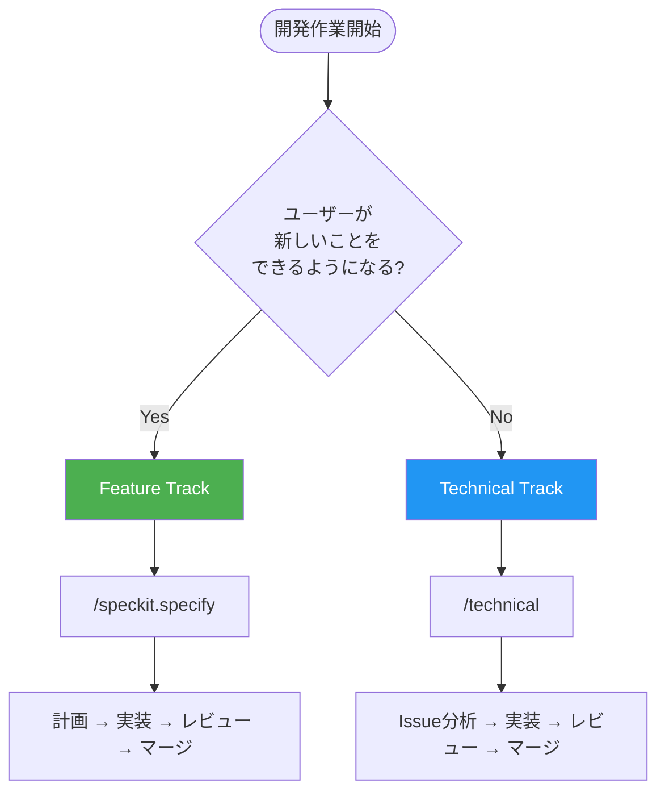
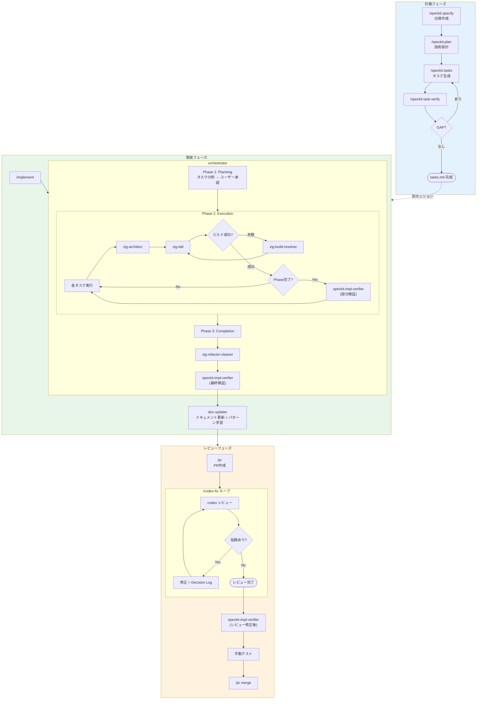
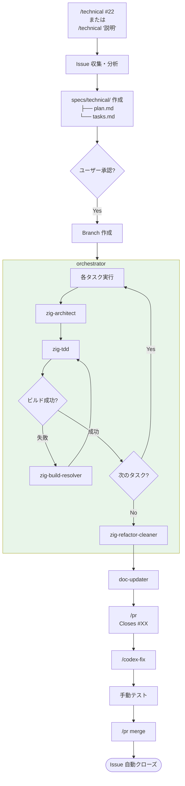
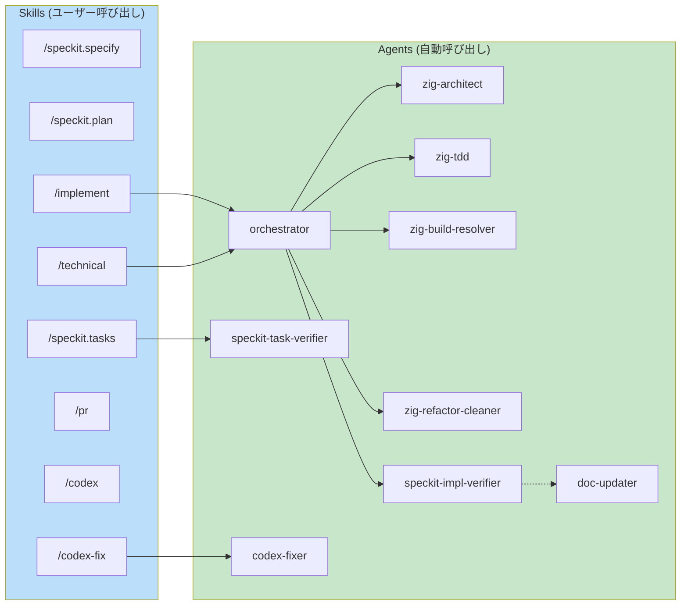
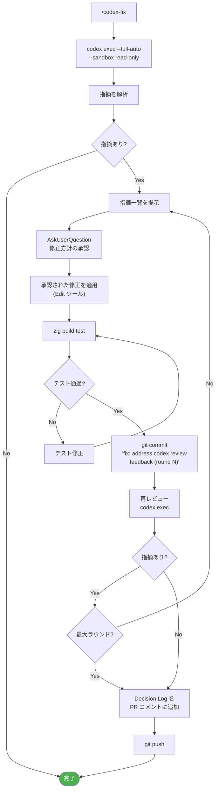
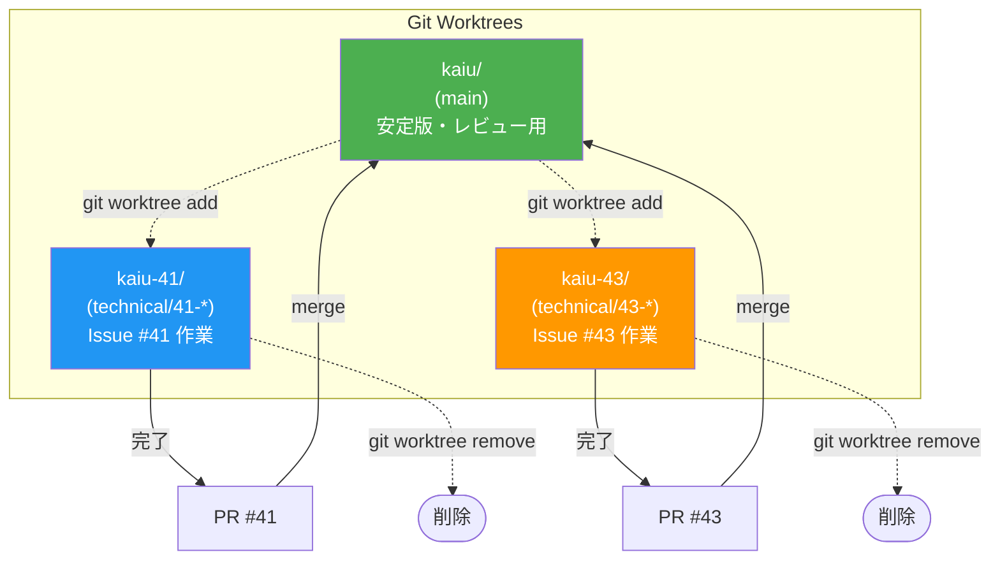
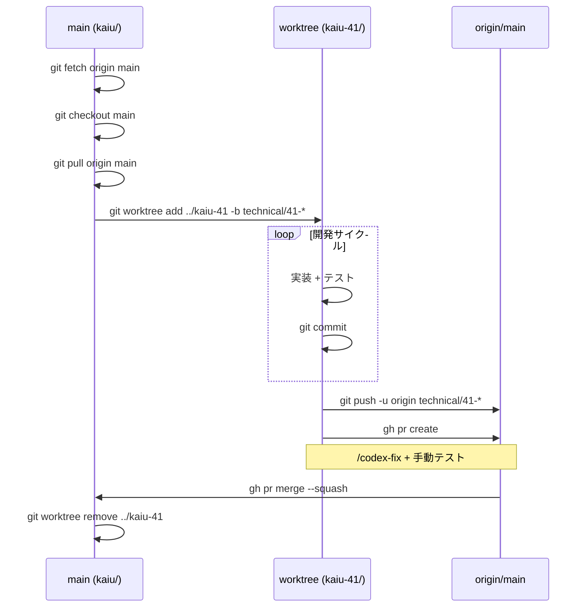
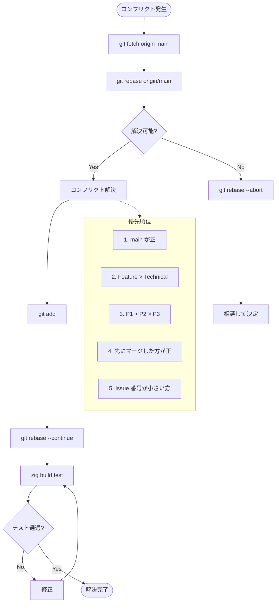
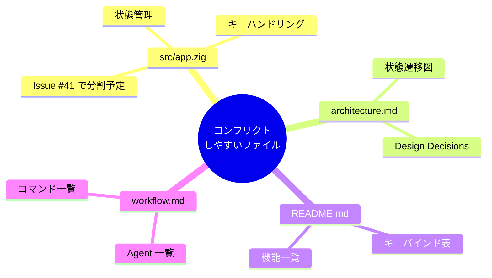

# Workflow Diagrams

kaiu 開発ワークフローの Mermaid 図式。詳細は `.claude/rules/workflow.md` を参照。

---

## 1. Track Selection

---

## 2. Feature Track

---

## 3. Technical Track

---

## 4. Agent 連携図

---

## 5. /codex-fix ループ詳細

---

## 6. タイムライン概要

```mermaid
gantt
    title Feature Track タイムライン
    dateFormat X
    axisFormat %s

    section 計画
    /speckit.specify     :a1, 0, 1
    /speckit.plan        :a2, after a1, 1
    /speckit.tasks       :a3, after a2, 1
    /speckit.task-verify :a4, after a3, 1

    section 実装
    /implement (orchestrator) :b1, after a4, 3
    doc-updater              :b2, after b1, 1

    section レビュー
    /pr                  :c1, after b2, 1
    /codex-fix           :c2, after c1, 2
    speckit-impl-verifier :c3, after c2, 1
    手動テスト            :c4, after c3, 1
    /pr merge            :c5, after c4, 1
```

---

## 7. Worktree 並行開発

### Worktree ライフサイクル

### コンフリクト解決フロー

### ホットスポットファイル

---

## 8. コマンド早見表

| Phase | Feature Track | Technical Track |
|-------|---------------|-----------------|
| 開始 | `/speckit.specify` | `/technical` |
| 計画 | `/speckit.plan` → `/speckit.tasks` | (自動生成) |
| 検証 | `/speckit.task-verify` | - |
| 実装 | `/implement` | (自動) |
| PR | `/pr` | `/pr` |
| レビュー | `/codex-fix` | `/codex-fix` |
| マージ | `/pr merge` | `/pr merge` |
