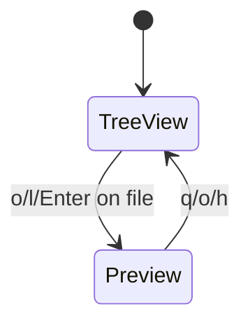

# Doc Update

ドキュメントをコードベースと同期させ、学習したパターンを保存するスキル。

## 使用タイミング

```
/implement → speckit-impl-verifier → /doc-update → /pr → /codex-fix → マージ
                                         ↑
                                      ここで実行
```

## 実行手順

### Step 1: 変更内容の把握

```bash
# 最近のコミットを確認
git log --oneline -10

# 変更されたファイルを確認
git diff main --stat
```

### Step 2: ドキュメント更新チェック

以下のドキュメントを確認し、必要に応じて更新:

| ファイル | 更新トリガー |
|----------|-------------|
| `README.md` | キーバインド追加/変更、新機能追加 |
| `CLAUDE.md` | プロジェクト概要の変更 |
| `.claude/rules/architecture.md` | AppMode追加、状態遷移変更 |
| `.claude/rules/workflow.md` | Agent/コマンド追加 |
| `.claude/rules/workflow-diagrams.md` | ワークフロー変更 |

### Step 3: 整合性検証

```bash
# キーバインドの実装を確認
rg "handleTreeKey|handlePreviewKey" src/app.zig

# AppMode の定義を確認
rg "pub const AppMode" src/app.zig
```

README.md のキーバインド表とコードが一致しているか確認。

### Step 4: パターン学習

セッションで発見した有用なパターンを抽出:

**抽出対象:**
- 非自明なエラー解決
- libvaxis 使用パターン
- build.zig パターン
- メモリ管理戦略
- Zig イディオム

**保存先:** `.claude/skills/learned/[pattern-name].md`

**テンプレート:**

```markdown
---
name: [pattern-name]
description: [When to use this pattern]
---

# [Pattern Name]

**Extracted:** [Date]
**Context:** [When this applies]

## Problem
[What problem this solves]

## Solution
\`\`\`zig
// Code example
\`\`\`

## When to Use
[Trigger conditions]
```

### Step 5: 完了レポート

更新内容をサマリーとして出力:

```
=== Doc Update Complete ===

■ ドキュメント更新
- README.md: [更新内容]
- architecture.md: [更新内容]

■ パターン学習
- 保存: [pattern-name].md
  "[パターンの説明]"

■ 更新なし
- CLAUDE.md: 変更不要
- workflow.md: 変更不要

次のステップ: /pr
```

## 更新ガイドライン

### キーバインド表 (README.md)

```markdown
| Key | Action |
|-----|--------|
| `j` / `↓` | Move down |
| `k` / `↑` | Move up |
```

- コードの実際のキーハンドリングと一致させる
- モード別のキーは適切なセクションに配置
- 廃止されたキーは削除

### 状態遷移図 (architecture.md)



- AppMode enum と一致させる
- 状態遷移表も更新

### architecture.md と `.claude/skills/learned/` の分離

| 保存先 | 内容 |
|--------|------|
| `architecture.md` | kaiu 固有の決定 (「何を決めたか」) |
| `.claude/skills/learned/` | 汎用パターン (「なぜそうなのか」) |

**参照形式:**
```markdown
**Rationale**: See `.claude/skills/learned/[pattern-name].md`
```

## 原則

> ドキュメントが現実と一致しないなら、ドキュメントがない方がマシ

- **正確性優先**: 推測で書かない
- **簡潔に**: 冗長な説明を避ける
- **コードが正**: 矛盾があればコードに合わせる

## Agent 呼び出し

より詳細な更新が必要な場合は `doc-updater` Agent を使用:

```
Task tool で doc-updater agent を呼び出し
```

Agent は以下を自動で実行:
1. コード差分の分析
2. 影響ドキュメントの特定
3. 更新の実行
4. パターン抽出と保存
5. 完了レポートの生成
