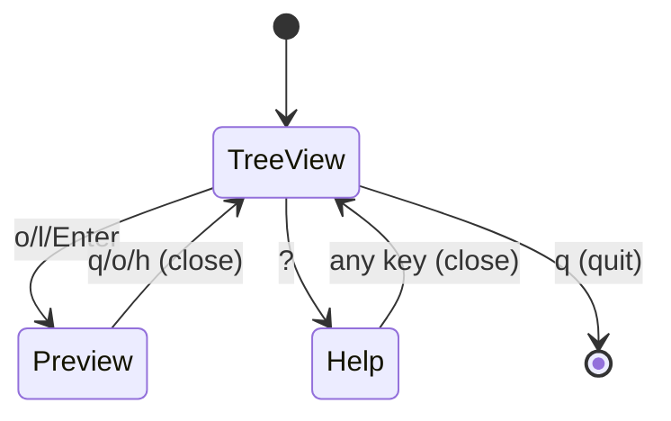

# TUI Modal Key Consistency Pattern

**Extracted:** 2026-01-26
**Context:** When implementing modal views (preview, help, search) in TUI applications

## Problem

In modal TUI applications, users expect consistent key behavior across different views. When a key has context-dependent meaning (e.g., "q" = quit app vs. close modal), the behavior should align with user intuition and common TUI conventions.

## Solution

### Principle: "q" Closes the Current View

Users expect "q" to close/exit the **current context**, not always quit the entire application:

- **In main view**: "q" quits the application
- **In modal view** (preview, help, dialog): "q" closes the modal and returns to main view

### Implementation Pattern

```zig
pub const AppMode = enum {
    tree_view,    // Main application mode
    preview,      // Modal file preview
    help,         // Modal help screen
    search,       // Modal search input
};

fn handleKey(self: *App, key: u21) void {
    switch (self.mode) {
        .tree_view => switch (key) {
            'q' => self.quit(),  // Quit application
            // ...
        },
        .preview => switch (key) {
            'q', 'o', 'h' => self.closePreview(),  // Close modal
            // 'o' = toggle (same as opener)
            // 'h' = go back (Vim-like)
            // ...
        },
        .help => switch (key) {
            _ => self.closeHelp(),  // Any key closes
        },
        .search => switch (key) {
            'q' => {},  // 'q' types 'q' in search
            vaxis.Key.escape => self.cancelSearch(),
            // ...
        },
    }
}
```

### Status Bar Hints

Update hints to reflect modal behavior:

```zig
const hints: []const u8 = switch (self.mode) {
    .tree_view => "?:help  q:quit",
    .preview => "j/k:scroll  q/o/h:close",
    .help => "any key to close",
    .search => "Enter:confirm  Esc:cancel",
};
```

## State Machine Representation



## When to Use

1. **Multi-modal TUI apps**: Applications with distinct view modes
2. **Overlay views**: Help screens, previews, dialogs
3. **Vim-inspired UIs**: Where modal editing concepts apply

## Anti-patterns

**Bad**: "q" always quits the application
```zig
// User in preview mode, presses 'q' to close preview
// → Application quits unexpectedly
.preview => switch (key) {
    'q' => self.quit(),  // ❌ Unintuitive
}
```

**Good**: "q" closes current context
```zig
// User in preview mode, presses 'q' to close preview
// → Returns to tree view (as expected)
.preview => switch (key) {
    'q', 'o', 'h' => self.closePreview(),  // ✅ Intuitive
}
```

## Related Patterns

- **Modal Confirmation**: Dialogs where "q" might cancel
- **Escape Key Hierarchy**: Esc for cancel, q for close, multiple Esc for quit
- **TUI File Explorer Conventions**: Standard key mappings

## References

- Vim: Modal editing with context-aware commands
- ranger/lf/nnn: Preview modes close with 'q'
- less/more: 'q' exits pager view
