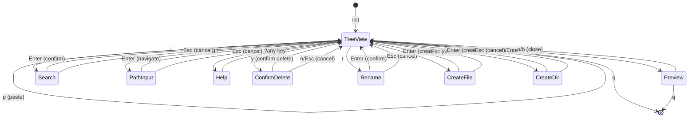

# Implementation Plan: Phase 2 - File Operations & Utilities

**Branch**: `phase2-file-operations` | **Date**: 2026-01-24 | **Spec**: [spec.md](./spec.md)
**Input**: Feature specification from `specs/002-file-operations/spec.md`

## Summary

Phase 2 extends kaiu with file management capabilities: marking, copy/cut/paste, delete, rename, and create. The implementation builds on the existing Zig 0.14.0 + libvaxis architecture, adding new AppMode variants for confirmation dialogs and input modes, plus new state structures for marked files and clipboard operations.

**Already Implemented in Phase 1**:
- Search (`/`, `n`/`N`, `Esc`)
- Help overlay (`?`)
- Jump navigation (`gg`, `G`)
- Path copy to clipboard (`c`/`C` via OSC 52)
- Multi-key command infrastructure (`pending_key`)
- Input buffer infrastructure (`input_buffer`)

**Implemented in Phase 2** (PR #13):
- File marking (Space toggle, visual indicator)
- Yank/Cut/Paste (`y`/`d`/`p`)
- Delete with confirmation (`D`)
- Rename (`r`)
- Create file/directory (`a`/`A`)

**Pending in Phase 2**:
- Status bar absolute path display with `~` prefix - Task 2.14

## Technical Context

**Language/Version**: Zig 0.14.0
**Primary Dependencies**: libvaxis (TUI rendering)
**Storage**: Local filesystem operations via `std.fs`
**Testing**: `zig build test` (unit tests)
**Target Platform**: Linux/macOS, Ghostty terminal (primary)
**Project Type**: Single CLI application
**Performance Goals**: < 16ms frame time, handle 10,000+ files
**Constraints**: < 100MB memory, no external runtime dependencies
**Scale/Scope**: Single directory tree, typical project sizes

## Constitution Check

| Principle | Status | Notes |
|-----------|--------|-------|
| Target User | PASS | File operations benefit developers transitioning to terminal |
| Technology Stack | PASS | Zig + libvaxis, Ghostty primary |
| Design Principles | PASS | Vim keybindings (Space, y, d, p, D, r, a, A) |
| Core Features | PASS | Extends MVP with file management |
| Quality Standards | PASS | Confirmation dialogs prevent accidental deletion |
| What kaiu is NOT | **UPDATED** | Constitution says "no copy/move/delete in MVP". Phase 2 is post-MVP, this is intentional extension. |

**Note**: Constitution states kaiu is "Not a file manager (no copy/move/delete in MVP)". Phase 2 explicitly extends beyond MVP to add these features. This is a planned evolution, not a violation.

## Architecture Decisions

### 1. New AppMode Variants

Current `AppMode`:
```zig
pub const AppMode = enum {
    tree_view,
    preview,
    search,
    path_input,
    help,
};
```

Extended `AppMode` for Phase 2:
```zig
pub const AppMode = enum {
    tree_view,
    preview,
    search,
    path_input,
    help,
    // Phase 2 additions:
    confirm_delete,  // Delete confirmation dialog
    rename,          // Inline rename input
    create_file,     // New file input
    create_dir,      // New directory input
};
```

**Decision**: Add separate modes for each input context rather than a generic "input" mode.
**Rationale**: Different modes have different behaviors (rename shows current filename, create starts empty) and different key handlers.

### 2. MarkedFiles State

Two options considered:

**Option A: Boolean field on FileEntry**
```zig
pub const FileEntry = struct {
    // ... existing fields
    is_marked: bool,  // NEW
};
```

**Option B: Separate HashSet in App**
```zig
// In App struct
marked_files: std.StringHashMap(void),  // paths as keys
```

**Decision**: Option B (Separate HashSet)
**Rationale**:
- FileEntry is owned by FileTree, should not have UI state
- Paths are stable identifiers even after tree refresh
- Easier to clear all marks, count marks, iterate marks
- Tree refresh doesn't lose mark state

**Implementation**:
```zig
// In App struct
marked_files: std.StringHashMap(void),

// Operations
pub fn toggleMark(self: *Self) void {
    if (self.getCurrentEntryPath()) |path| {
        if (self.marked_files.contains(path)) {
            _ = self.marked_files.remove(path);
        } else {
            self.marked_files.put(path, {}) catch {};
        }
    }
}

pub fn getMarkedCount(self: *Self) usize {
    return self.marked_files.count();
}
```

### 3. Clipboard State (Yank/Cut)

```zig
pub const ClipboardOperation = enum {
    yank,  // copy
    cut,   // move
};

pub const FileClipboard = struct {
    allocator: std.mem.Allocator,
    files: std.ArrayList([]const u8),  // owned paths
    operation: ClipboardOperation,

    pub fn init(allocator: std.mem.Allocator) FileClipboard {
        return .{
            .allocator = allocator,
            .files = .empty,
            .operation = .yank,
        };
    }

    pub fn deinit(self: *FileClipboard) void {
        for (self.files.items) |path| {
            self.allocator.free(path);
        }
        self.files.deinit(self.allocator);
    }

    pub fn clear(self: *FileClipboard) void {
        for (self.files.items) |path| {
            self.allocator.free(path);
        }
        self.files.clearRetainingCapacity();
    }

    pub fn setFiles(self: *FileClipboard, paths: []const []const u8, op: ClipboardOperation) !void {
        self.clear();
        self.operation = op;
        for (paths) |path| {
            const duped = try self.allocator.dupe(u8, path);
            try self.files.append(self.allocator, duped);
        }
    }
};
```

**Memory Strategy**: FileClipboard owns its path strings (allocator.dupe). Clear frees all, deinit frees all. This matches the existing pattern for preview_content/preview_path.

### 4. File Operations Module

Create a new module `fileops.zig` for filesystem operations:

```zig
// src/fileops.zig
const std = @import("std");

pub const FileOpError = error{
    AccessDenied,
    FileExists,
    NotFound,
    DirectoryNotEmpty,
    InvalidName,
    IoError,
};

/// Copy a file or directory recursively
pub fn copy(src: []const u8, dst: []const u8) FileOpError!void {
    // Implementation using std.fs
}

/// Move a file or directory (copy + delete)
pub fn move(src: []const u8, dst: []const u8) FileOpError!void {
    try copy(src, dst);
    try deleteRecursive(src);
}

/// Delete a file or directory recursively
pub fn deleteRecursive(path: []const u8) FileOpError!void {
    // Use std.fs.deleteTree for directories
    // Use std.fs.deleteFile for files
}

/// Rename a file or directory
pub fn rename(old_path: []const u8, new_name: []const u8) FileOpError!void {
    // std.fs.rename
}

/// Create a new file
pub fn createFile(path: []const u8) FileOpError!void {
    const file = std.fs.cwd().createFile(path, .{ .exclusive = true }) catch |err| {
        return mapError(err);
    };
    file.close();
}

/// Create a new directory
pub fn createDir(path: []const u8) FileOpError!void {
    std.fs.cwd().makeDir(path) catch |err| {
        return mapError(err);
    };
}

/// Generate unique filename for conflict resolution
pub fn resolveConflict(allocator: std.mem.Allocator, dir: []const u8, name: []const u8) ![]const u8 {
    // Try name, then name_1, name_2, etc.
    // For "file.txt" -> "file_1.txt", "file_2.txt"
}
```

**Decision**: Separate module for file operations.
**Rationale**:
- Single responsibility: file operations separate from UI logic
- Testable: can unit test file operations independently
- Reusable: all file ops (copy, move, delete, rename, create) in one place

### 5. Delete Confirmation Dialog

**UI Design**:
```
  +---------------------------------+
  |  Delete 2 files?                |
  |  - main.zig                     |
  |  - utils.zig                    |
  |                                 |
  |  [y] Yes    [n] No              |
  +---------------------------------+
```

**State**:
```zig
// In App struct
confirm_delete_files: std.ArrayList([]const u8),  // files pending deletion
```

**Flow**:
1. User presses `D`
2. Collect files to delete (marked or current)
3. Store in `confirm_delete_files`
4. Switch to `confirm_delete` mode
5. Render dialog overlay
6. On `y`: Execute deletion, refresh tree, return to tree_view
7. On `n`/`Esc`: Clear pending, return to tree_view

### 6. Rename/Create Input Modes

Reuse existing `input_buffer` for all text input modes. The `AppMode` determines context:

```zig
fn handleRenameKey(self: *Self, key: vaxis.Key, key_char: u21) !void {
    switch (key_char) {
        vaxis.Key.escape => {
            self.input_buffer.clearRetainingCapacity();
            self.mode = .tree_view;
        },
        vaxis.Key.enter => {
            try self.executeRename();
        },
        vaxis.Key.backspace => {
            if (self.input_buffer.items.len > 0) {
                _ = self.input_buffer.pop();
            }
        },
        else => {
            if (key_char >= 0x20 and key_char < 0x7F) {
                try self.input_buffer.append(self.allocator, @intCast(key_char));
            }
        },
    }
}
```

**Rename initialization**:
```zig
fn enterRenameMode(self: *Self) void {
    if (self.getCurrentEntry()) |entry| {
        self.input_buffer.clearRetainingCapacity();
        // Pre-populate with current filename
        self.input_buffer.appendSlice(self.allocator, entry.name) catch {};
        self.mode = .rename;
    }
}
```

### 7. Status Bar Updates

Extend status bar to show:
- Marked count: `2 marked` (when > 0)
- Clipboard state: `3 files yanked` / `1 file cut`
- Mode-specific hints

```zig
fn renderStatusRow1(self: *Self, win: vaxis.Window, arena: std.mem.Allocator, row: u16) !void {
    // ... existing code ...

    // Show marked count on the left after path
    if (self.marked_files.count() > 0) {
        const marked_str = try std.fmt.allocPrint(arena, " ({d} marked)", .{self.marked_files.count()});
        // Render after path
    }
}
```

## Memory Strategy

| Component | Allocator | Ownership |
|-----------|-----------|-----------|
| marked_files | App.allocator | StringHashMap owns keys (paths) |
| file_clipboard.files | App.allocator | FileClipboard owns path strings |
| confirm_delete_files | App.allocator | ArrayList owns path strings |
| input_buffer | App.allocator | Shared for rename/create (existing) |

**Lifecycle**:
- `marked_files`: Created in App.init, cleared on tree reload, freed in App.deinit
- `file_clipboard`: Created in App.init, cleared on new yank/cut, freed in App.deinit
- `confirm_delete_files`: Created when entering confirm mode, freed after confirm/cancel

## Updated State Machine



## Module Structure Update

```
src/
├── main.zig       # Entry point (unchanged)
├── app.zig        # App state, event loop (+new modes, +marking, +clipboard)
├── tree.zig       # FileTree data structure (unchanged)
├── ui.zig         # Rendering (+mark indicator, +confirm dialog, +input prompts)
└── fileops.zig    # NEW: File operations (copy, move, delete, rename, create)
```

## Implementation Phases

Based on User Story priorities from spec:

### Phase 2.1: Infrastructure (Pre-requisite)
**Tasks**: 2.12 (Input Mode Infrastructure)
- Already partially implemented via `input_buffer`
- Ensure consistent input handling across modes

### Phase 2.2: File Marking (P1 - US1)
**Tasks**: 2.1, 2.13 (partial)
- Add `marked_files: StringHashMap(void)` to App
- Implement Space toggle
- Render `*` indicator in ui.zig
- Show marked count in status bar

### Phase 2.3: Yank/Cut/Paste (P1 - US1)
**Tasks**: 2.2, 2.3
- Add `FileClipboard` struct
- Implement `y` to yank
- Implement `d` to cut
- Implement `p` to paste
- Create `fileops.zig` with copy/move functions
- Handle filename conflicts

### Phase 2.4: Delete with Confirmation (P1 - US2)
**Tasks**: 2.4
- Add `confirm_delete` AppMode
- Add `confirm_delete_files` ArrayList
- Render confirmation dialog
- Implement `y`/`n`/`Esc` handlers
- Create recursive delete in fileops.zig

### Phase 2.5: Rename & Create (P2 - US3)
**Tasks**: 2.5, 2.6
- Add `rename`, `create_file`, `create_dir` AppModes
- Pre-populate input for rename
- Create file/directory via fileops.zig
- Handle errors (exists, invalid name)

### Phase 2.6: Polish & Status Bar (P3)
**Tasks**: 2.13 (remaining), 2.14
- Enhance status bar with all states
- Context-sensitive hints
- **Status bar path display**: Resolve `.` to absolute path with `~` prefix
- Test edge cases

## Already Implemented (Skip)

The following from spec are already implemented in Phase 1:
- **US4 Search**: `/`, `n`/`N`, `Esc`, highlight, match count
- **US5 Jump Navigation**: `gg`, `G`
- **US6 Clipboard**: `c`/`C` (path copy via OSC 52)
- **US6 Help**: `?` overlay

These tasks from tasks.md can be marked complete:
- Task 2.7 (Clipboard/Path Copy)
- Task 2.8 (Search Mode)
- Task 2.9 (Search Navigation)
- Task 2.10 (Jump Navigation)
- Task 2.11 (Help Overlay)

## Error Handling

| Operation | Possible Errors | User Feedback |
|-----------|----------------|---------------|
| Copy/Paste | AccessDenied | "Permission denied: <file>" |
| Copy/Paste | DiskFull | "Disk full" |
| Delete | AccessDenied | "Cannot delete: <file>" |
| Rename | FileExists | "File already exists: <name>" |
| Create | InvalidName | "Invalid filename" |
| Create | FileExists | "Already exists: <name>" |

All errors displayed as status_message, operation cancelled, return to tree_view.

## Testing Strategy

1. **Unit Tests** (fileops.zig):
   - Copy file
   - Copy directory recursively
   - Delete file
   - Delete directory recursively
   - Rename
   - Create file/directory
   - Conflict resolution

2. **Integration Tests** (manual):
   - Mark multiple files, yank, paste to different directory
   - Cut and paste (verify source deleted)
   - Delete with confirmation (y and n paths)
   - Rename with special characters
   - Create in read-only directory (expect error)

3. **Regression Tests**:
   - Verify all Phase 1 features still work
   - Search after marking
   - Preview after delete

## Complexity Tracking

No Constitution violations requiring justification.

## Open Questions

1. **Conflict Resolution**: Auto-number vs. prompt user?
   - **Decision**: Auto-number (simpler UX, matches ranger behavior)

2. **Large File Operations**: Progress indicator?
   - **Decision**: Defer to Phase 3. For Phase 2, block during operation with "Working..." status.

3. **Mark persistence across tree refresh**:
   - **Decision**: Clear marks on `R` (reload). Paths may become invalid.

4. **Delete non-empty directory**:
   - **Decision**: Confirm dialog shows "N files inside" warning, recursive delete on confirm.
