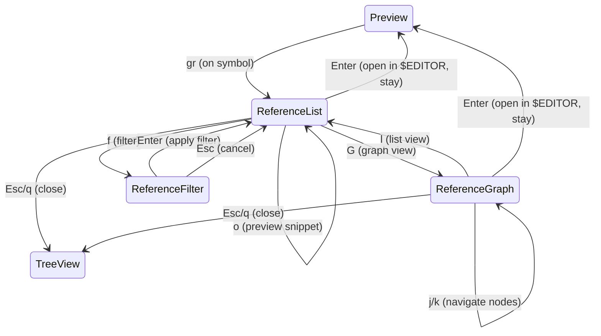

# Technical Plan: Phase 4.0 - Symbol Reference Graph

**Feature Branch**: `060-symbol-reference-graph`
**Created**: 2026-01-30
**Status**: Draft

---

## 1. Technical Context

### Technology Stack

| Component | Technology | Notes |
|-----------|------------|-------|
| Language | Zig (latest stable) | Constitution: Zig (latest stable version) |
| TUI Library | libvaxis | Constitution: 既存スタック継続 |
| LSP Server | zls (Zig Language Server) | 外部依存、ユーザー環境に要インストール |
| LSP Protocol | JSON-RPC 2.0 over stdio | 標準的な LSP 通信方式 |
| Graph Rendering | Kitty Graphics Protocol / Text fallback | Constitution: Kitty Graphics Protocol for image preview |
| Target Terminal | Ghostty (primary) | Constitution: Ghostty (primary), but should work on any modern terminal |

### LSP Communication Method

**JSON-RPC over stdio** を採用:

```
kaiu (client) <--stdio--> zls (server)
     |                        |
     |-- initialize --------->|
     |<-- initialized --------|
     |                        |
     |-- textDocument/didOpen -->|
     |                        |
     |-- textDocument/references -->|
     |<-- result (locations[]) --|
```

**選択理由**:
1. **シンプル**: TCP/socket より設定不要
2. **信頼性**: プロセス間通信で確実
3. **標準的**: 多くの LSP クライアントが採用
4. **デバッグ容易**: stdin/stdout をログ可能

### Graph Display Strategy

**2段階アプローチ**:

1. **Primary (US2)**: Kitty Graphics Protocol
   - Graphviz で DOT 形式を生成 → PNG 画像 → Kitty Graphics で表示
   - 既存の `image.zig` / `kitty_gfx.zig` パターンを再利用

2. **Fallback (FR-013)**: テキストベースツリー表示
   - ASCII art でツリー構造を表示
   - 既存の TreeView レンダリングパターンを応用

```
// Graphviz DOT 形式の例
digraph references {
    "main.zig:42" -> "lib.zig:15"
    "main.zig:42" -> "util.zig:88"
    "app.zig:123" -> "main.zig:42"
}
```

---

## 2. Constitution Check

### Principle Alignment

| Principle | Status | Notes |
|-----------|--------|-------|
| Target User | OK | 「Claude Code でコードを生成しながら開発中」のユーザーがシンボル参照を把握したい |
| Technology Stack | OK | Zig + libvaxis + Kitty Graphics Protocol を継続使用 |
| Familiarity | OK | VSCode の「Go to References」「Find All References」に相当 |
| Vim-native | OK | `gr` (go to references)、`j`/`k` 移動、`Enter` で開く |
| Progressive disclosure | OK | 基本は一覧表示、`G` で高度なグラフ表示 |
| No configuration required | Partial | zls のインストールはユーザー責任だが、kaiu 側の設定は不要 |
| No runtime crashes | OK | LSP 未インストール/タイムアウト時も graceful に処理 |
| Responsive UI | OK | LSP リクエストは非同期、タイムアウト設定あり |
| Memory efficient | OK | 参照結果はページネーション/スクロールで対応 |

### Constitution Tensions

**「No configuration required」との緊張**:
- zls のインストールはユーザー責任
- ただし kaiu 自体は設定不要で動作
- LSP がなくても「Language server not available」と表示してクラッシュしない
- **結論**: Constitution 違反ではない (外部ツールの存在チェックは許容)

**「What kaiu is NOT - Not an IDE」との緊張**:
- シンボル参照検索は IDE 機能に近い
- ただし「コード編集」「補完」「自動インポート」は Out of Scope で明確に除外
- kaiu の役割は「ファイルエクスプローラーからの参照検索」であり、IDE 機能への窓口
- **結論**: IDE 化ではなく、IDE 連携機能として許容

---

## 3. Architecture Decisions

### 3.1 New AppMode

```zig
pub const AppMode = enum {
    // ... existing modes ...
    tree_view,
    preview,
    search,
    rename,
    new_file,
    new_dir,
    confirm_delete,
    confirm_overwrite,
    help,

    // Phase 4.0: Symbol Reference
    reference_list,   // US1: 参照一覧表示
    reference_graph,  // US2: グラフ表示
    reference_filter, // US3: フィルタ入力
};
```

**State Transitions**:



### 3.2 New Modules

```
src/
├── ... existing ...
├── lsp.zig           # LSP client (JSON-RPC over stdio)
├── reference.zig     # Reference data structures & operations
└── graph.zig         # Graph data structure & rendering
```

**Module Responsibilities**:

| Module | Responsibility |
|--------|---------------|
| lsp.zig | LSP プロセス管理、JSON-RPC 通信、リクエスト/レスポンス処理 |
| reference.zig | SymbolReference 構造体、参照一覧のフィルタリング・ソート |
| graph.zig | ReferenceGraph 構造体、DOT 生成、テキストツリー生成 |

### 3.3 LSP Client Design

```zig
// src/lsp.zig

pub const LspClient = struct {
    allocator: std.mem.Allocator,
    process: ?std.process.Child,
    stdin: ?std.fs.File,
    stdout: ?std.fs.File,
    request_id: u32,
    pending_requests: std.AutoHashMap(u32, RequestCallback),

    pub const Error = error{
        ServerNotFound,
        ServerNotRunning,
        RequestTimeout,
        InvalidResponse,
        OutOfMemory,
    };

    pub fn init(allocator: std.mem.Allocator) LspClient;
    pub fn deinit(self: *LspClient) void;

    /// zls を起動して initialize ハンドシェイクを完了
    pub fn start(self: *LspClient, root_path: []const u8) Error!void;

    /// プロセスを終了
    pub fn stop(self: *LspClient) void;

    /// textDocument/references リクエスト
    pub fn findReferences(
        self: *LspClient,
        file_path: []const u8,
        line: u32,
        column: u32,
    ) Error![]SymbolReference;
};
```

**Lifecycle Management**:
- kaiu 起動時には LSP を起動しない (遅延起動)
- `gr` キー押下時に初めて起動 (FR-030)
- kaiu 終了時に LSP プロセスも終了 (FR-033)
- タイムアウト (5秒) でエラー表示、再試行オプション (FR-032)

### 3.4 Reference Data Structures

```zig
// src/reference.zig

pub const SymbolReference = struct {
    file_path: []const u8,    // 絶対パス
    line: u32,                // 1-indexed
    column: u32,              // 1-indexed
    snippet: []const u8,      // コードスニペット (該当行 +/- context)
    context_before: []const u8, // +3 行
    context_after: []const u8,  // -3 行
};

pub const ReferenceList = struct {
    allocator: std.mem.Allocator,
    symbol_name: []const u8,
    references: std.ArrayList(SymbolReference),
    filtered: std.ArrayList(usize),  // filtered indices
    filter_pattern: ?[]const u8,

    pub fn init(allocator: std.mem.Allocator, symbol: []const u8) ReferenceList;
    pub fn deinit(self: *ReferenceList) void;
    pub fn applyFilter(self: *ReferenceList, pattern: []const u8) void;
    pub fn clearFilter(self: *ReferenceList) void;
};
```

### 3.5 Graph Data Structures

```zig
// src/graph.zig

pub const GraphNode = struct {
    reference: *SymbolReference,
    edges: std.ArrayList(*GraphNode), // outgoing edges (calls to)
};

pub const ReferenceGraph = struct {
    allocator: std.mem.Allocator,
    nodes: std.ArrayList(GraphNode),
    root: ?*GraphNode,

    pub fn init(allocator: std.mem.Allocator) ReferenceGraph;
    pub fn deinit(self: *ReferenceGraph) void;
    pub fn buildFromReferences(self: *ReferenceGraph, refs: []SymbolReference) void;
    pub fn toDot(self: *ReferenceGraph, arena: std.mem.Allocator) []const u8;
    pub fn toTextTree(self: *ReferenceGraph, arena: std.mem.Allocator) []const u8;
};
```

### 3.6 Memory Strategy

| Component | Allocator | Rationale |
|-----------|-----------|-----------|
| LspClient.pending_requests | GeneralPurposeAllocator | 動的に増減、個別解放 |
| SymbolReference.* | GeneralPurposeAllocator | LSP レスポンスをパース、個別所有 |
| ReferenceList | GeneralPurposeAllocator | 参照リストの動的管理 |
| ReferenceGraph | ArenaAllocator | グラフ全体を一括解放 |
| DOT/TextTree 出力 | render_arena | フレームごとにリセット |

---

## 4. Implementation Phases

### Phase 1: LSP Infrastructure (US1 基盤)

**目標**: LSP クライアントの基盤を構築し、zls との通信を確立する

**成果物**:
- `src/lsp.zig` モジュール
- LSP プロセス起動/終了
- JSON-RPC over stdio 通信
- `initialize` / `textDocument/didOpen` 実装

**タスク概要**:
1. lsp.zig モジュール作成
2. JSON-RPC メッセージ構造体定義
3. プロセス起動・stdio 接続
4. initialize ハンドシェイク実装
5. エラーハンドリング (ServerNotFound, Timeout)

### Phase 2: Reference Search (US1 完成)

**目標**: シンボル参照検索を実装し、一覧表示する

**成果物**:
- `src/reference.zig` モジュール
- `textDocument/references` リクエスト実装
- `reference_list` モード
- 参照一覧 UI (j/k 移動、Enter で開く)

**タスク概要**:
1. reference.zig モジュール作成
2. textDocument/references リクエスト実装
3. AppMode.reference_list 追加
4. 参照一覧レンダリング (ui.zig 拡張)
5. Preview 連携 (`gr` キーバインド)
6. $EDITOR 連携 (Enter で外部エディタを開く)
7. エラー表示 ("No references found", "Language server not available")

### Phase 3: Graph Visualization (US2)

**目標**: 参照関係をグラフとして可視化する

**成果物**:
- `src/graph.zig` モジュール
- `reference_graph` モード
- Kitty Graphics でのグラフ表示
- テキストフォールバック

**タスク概要**:
1. graph.zig モジュール作成
2. GraphNode / ReferenceGraph 構造体
3. DOT 形式生成
4. Graphviz 呼び出し (外部プロセス)
5. Kitty Graphics でグラフ画像表示
6. テキストツリーフォールバック実装
7. AppMode.reference_graph 追加
8. グラフ/リスト表示切替 (G/l キー)

### Phase 4: Filtering (US3)

**目標**: 参照のフィルタリング機能を追加する

**成果物**:
- `reference_filter` モード
- glob パターンフィルタ
- フィルタ UI

**タスク概要**:
1. AppMode.reference_filter 追加
2. glob パターンマッチング実装
3. include/exclude パターン (`!` prefix)
4. フィルタ入力 UI (既存 input_buffer 再利用)
5. ステータスバーにフィルタ条件表示
6. フィルタクリア (Esc)

### Phase 5: Polish & Edge Cases

**目標**: エッジケース対応と品質向上

**成果物**:
- 循環参照検出
- ページネーション (100+ 参照)
- パフォーマンス最適化

**タスク概要**:
1. 循環参照検出・無限ループ防止
2. 100+ 参照時のページネーション/スクロール
3. 非 Zig ファイル対応 ("Unsupported file type")
4. LSP タイムアウト時の再試行オプション
5. ドキュメント更新 (README, architecture.md)

---

## 5. Risk Assessment

### High Risk

| Risk | Mitigation |
|------|------------|
| zls がインストールされていない環境 | graceful degradation + 明確なエラーメッセージ |
| LSP リクエストのタイムアウト | 5秒タイムアウト + 再試行オプション |
| Graphviz がインストールされていない | テキストフォールバックを必須実装 |

### Medium Risk

| Risk | Mitigation |
|------|------------|
| 大量の参照 (100+) | ページネーション/仮想スクロール |
| LSP プロセスのゾンビ化 | 既存の vcs.zig パターンを適用 (kill + waitpid) |
| グラフレイアウトの品質 | Graphviz に依存、代替は検討しない |

### Low Risk

| Risk | Mitigation |
|------|------------|
| JSON パースエラー | std.json の既存パターンを使用 |
| ファイル読み込みエラー | 既存の Preview パターンを適用 |

---

## 6. Dependencies

### External Dependencies

| Dependency | Required | Fallback |
|------------|----------|----------|
| zls (Zig Language Server) | Yes (for LSP) | "Language server not available" |
| Graphviz (dot command) | No | テキストツリー表示 |

### Internal Dependencies

| Module | Depends On |
|--------|------------|
| lsp.zig | std.process, std.json |
| reference.zig | lsp.zig |
| graph.zig | reference.zig, image.zig (Kitty Graphics) |
| app.zig | reference.zig, graph.zig |
| ui.zig | reference.zig, graph.zig |

---

## 7. Testing Strategy

### Unit Tests

| Module | Test Focus |
|--------|------------|
| lsp.zig | JSON-RPC メッセージ生成/パース |
| reference.zig | フィルタリング、ソート |
| graph.zig | DOT 生成、テキストツリー生成 |

### Integration Tests

| Scenario | Verification |
|----------|--------------|
| zls 未インストール | "Language server not available" 表示 |
| 参照なし | "No references found" 表示 |
| 参照 100+ | ページネーション動作 |
| グラフ表示 | Kitty Graphics / テキストフォールバック |

### Manual Tests

| Scenario | Verification |
|----------|--------------|
| 実際の Zig プロジェクトで `gr` | 参照一覧が表示される |
| Enter で $EDITOR | 外部エディタが正しい行で開く |
| G でグラフ表示 | グラフが表示される |
| f でフィルタ | フィルタが適用される |

---

## 8. Success Metrics

| Metric | Target | Measurement |
|--------|--------|-------------|
| SC-001: 2キー操作で検索 | 達成 | シンボル位置 + `gr` |
| SC-002: 3秒以内に結果表示 | 達成 | タイムアウト 5秒設定 |
| SC-003: グラフ 2秒以内 | 達成 | 50 ノード以下を制限 |
| SC-004: クラッシュしない | 達成 | graceful error handling |
| SC-005: テキストフォールバック | 達成 | Phase 3 で実装 |
